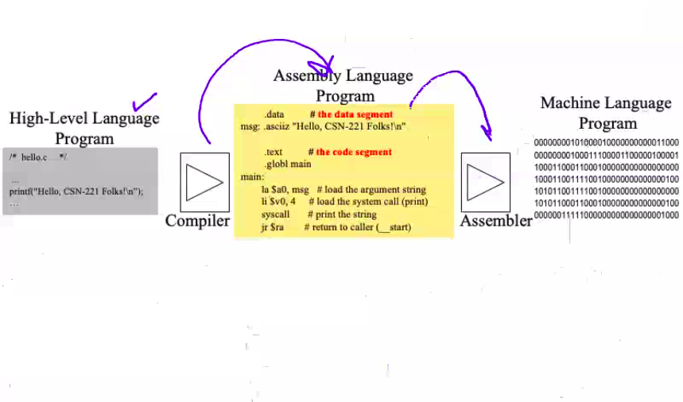
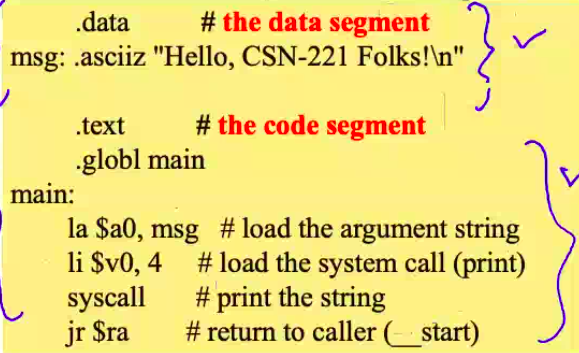
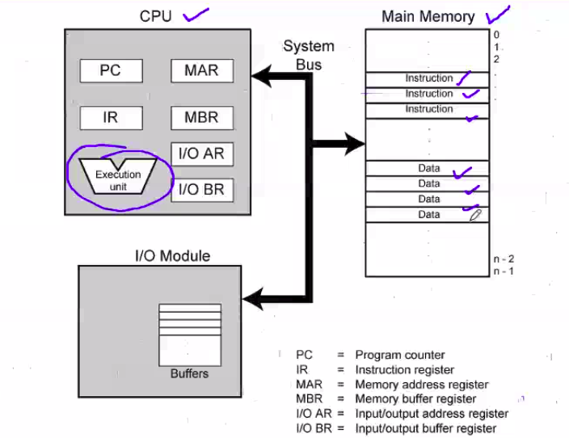
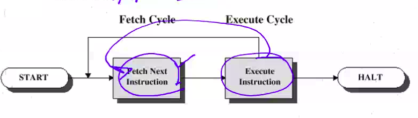
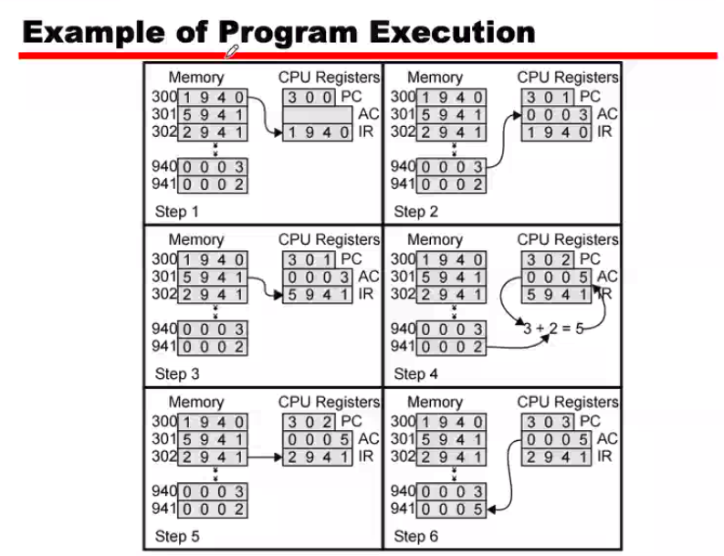

# September 2, 2020

### Read about the important model: Quantum Computers

### Assignment:
- What is a quantum computer in general?
- Study their architecture? How does it apply quantum physics to it?
- How is a quantum computer different from normal computers?

Deadline: September 9, 2020.
Submit at: 

If you are interested: figure out if we have any other model which are different from DF model, QC model and VN model

---

> Our course's focus is on Von Neumann Model

## Program
```
/* hello.c */
...
printf("Hello, CSN-221 Bois! \n");
...
```

|  |
|-|
| High-Level |
| Compiled |
| Assembly |
| Binary |

Different "ISA"

How the data is processed / stored in a computer system is seen by different hardware in different perspectives.

Eg: I wanted to store numbers in my memory

How is the processor organised? There are a lot of variations in the internals of the system. There must be some mechanism which hides the internals and converts my high level program into a medium that my low level executor can understand. 

`. Assembler .` 



## Abstraction
- Delving into the depths reveals more info but, we're not interested in it
- An abstraction omits unneeded details and helps us cope with complexity

## Instruction Set Architecture (ISA)
- A very important abstraction:
	- interface between hardware and low-level software
	- standardises instructions, machine language bit patterns, etc
	- advantage: allows different implementations of the same architecture
	- disadvantage: sometimes, prevents adding new innovations

## What is computer architecture?
> Computer Architecture = ISA + Machine Organisation

## Function of Control Unit
- For each operation a unique code is provided
	- e.g. : ADD, MOVE
- A hardware segment accepts the code and issues the control signals
- Compiler complete!

Each instruction has a code (as mentioned in first point), which is converted into binary.
eg:  A -> 65 -> 1000001 (+ ve Voltage vs - ve Voltage to represent 1s and 0s  -> control signals)

## Components
- The CU and the ALU form the CPU
- Data and instructions need to get into the system and results out
	- I/O
- Temporary storage of code and results is needed (Memory)

## Computer Components: Top Level View


**System bus**: Wires that connect different components of the system.

**CPU**:
- PC (program counter): contains address of next instruction.
- IR (instruction register): 
- Memory Address Register:
- Memory Buffer Register:
- I/O Address Register: 
- I/O Buffer Register: Stores results temporarily	

## Instruction Cycle
- Two Steps:
	- Fetch
	- Execute



### Fetch Cycle
- Program Counter holds the instruction to fetch
- The Processor fetches the instruction from that address and loads it into the **instruction register**.
- After fetching the instruction, the PC increments / progresses to the next instruction address.
	- *Unless told otherwise*
- Processor understand instruction and moves onto execution cycle.

### Execution Cycle
- Processor-memory
	- data transfer b/w CPU and main memory
- Processor I/O
	- Data transfer between CPU and I/O module
- Data processing:
	- Some arithmetic or logical operation on data
- Control
	- Alteration of sequence of operations
	- e.g. jump 
- Combination of above

eg: if you're trying to take input as two numbers for add program.
- Send value from input stream to CPU, and after program is complete, send result from CPU to I/O module. 

## Example of Program Execution


The numbers to the left of the boxes are addresses in the memory, and the numbers inside the grey boxes are values.

Step 1: Fetch instruction 300 (PC -> 301)
Step 2: Decode the instruction (PC -> 302)
Step 3: Fetch next instruction 
...

