# September 3, 2020
 
## Interrupts
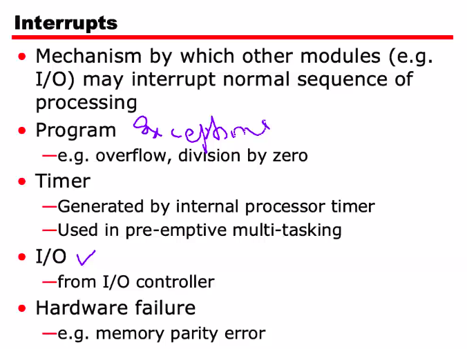

## Program Flow Control

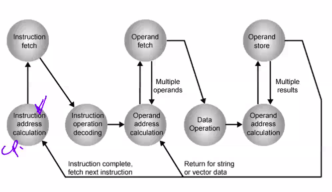

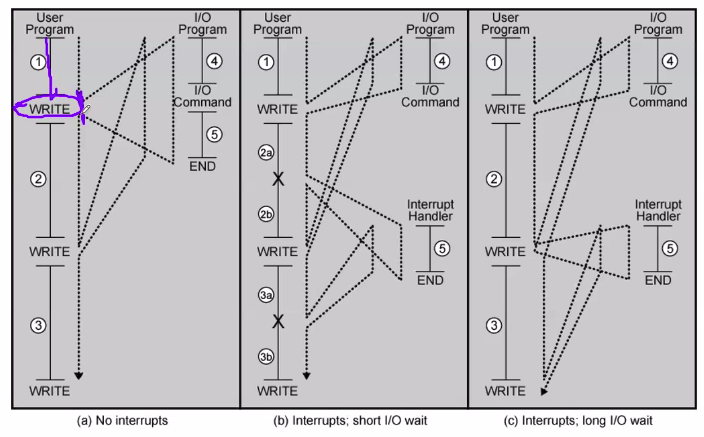
- Interrupt handlers: pre-defined programs to handle unexpected but anticipated events - exceptions - (e.g. buffer overflow, divide by zero etc.)

## Interrupt Cycle
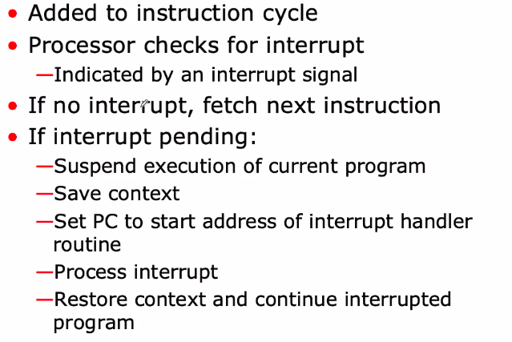

## Transfer of Control via Interrupts
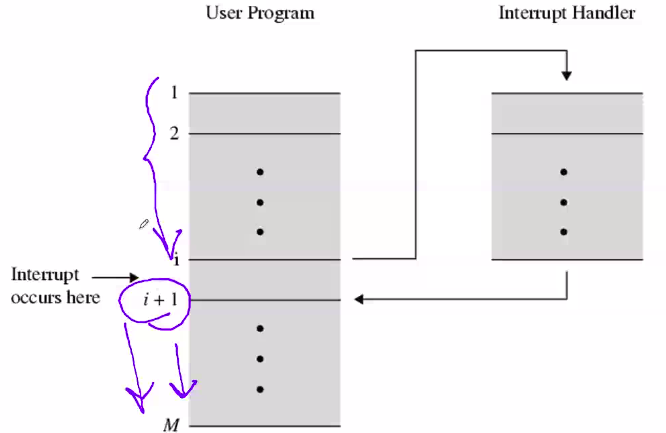

## Multiple interrupts
- Disable interrupts
	- Processor will ignore further interrupts whilst processing one interrupt
	- Interrupts remain pending and are checked after first interrupt has been processed
	- Interrupts handled in sequence as they occur
- Define priorities
	- Low priority interrupts can be interrupted by higher priority interrupts
	- When higher priority interrupt has been processed, processor returns to previous interrupt

- #### Problems with prioritising interrupts
	- If low priority interrupt arises before high priority interrupts, it may never get executed because high priority interrupts keep arising persistently (it will be kept in queue every time). This event is called **starvation**.

## Multiple Interrupts - Nested
> Interrupts may occur during other interrupts

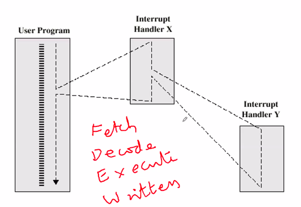

## Time Sequence of Multiple Interrupts
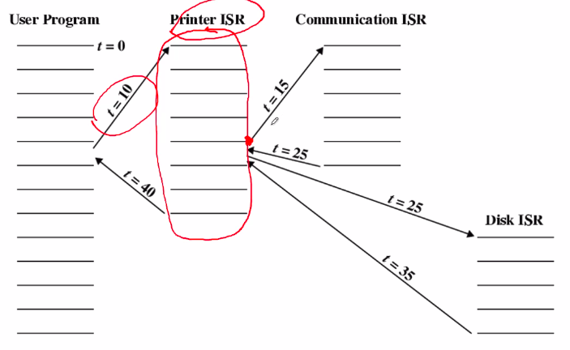

## Computer Modules

#### CPU:
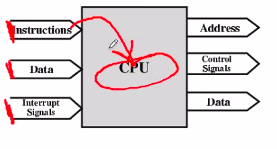

CPU gets the instruction from the memory using the provided address. Address is sent out from the CPU, instruction is sent back to the CPU from the memory. (SAME WITH DATA).

Once the instruction is executed, it must store the result in the memory, which it again sends to the assigned address.

The CPU has Input lines and output lines as shown in the diagram. (Left side input lines and right side output lines).

*Control Signals* tell the CPU what to do (RD vs WT)

#### Memory:
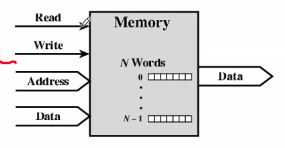

Memory takes Read/Write control signals from the Read and Write lines, address and data. It returns data found from 

#### I/O Module
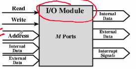

Note: I/O Module has interrupt signal lines going outside the module

## Connecting:
- All units must be connected
- Different types of connections are required for different types of units
	- Memory Connection
	- I/O Connection
	- CPU Connection

## Connecting
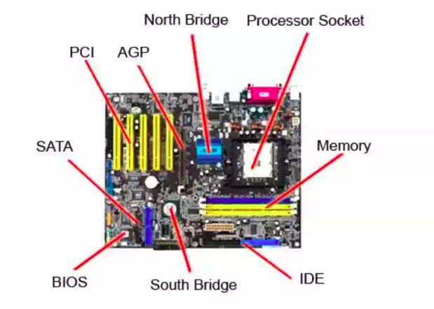
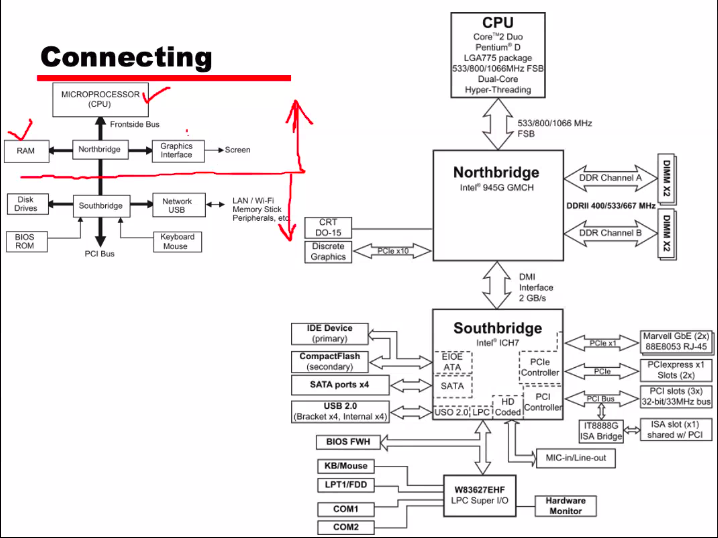

## Buses
- A common connection pathway connecting two or more devices
- Usually broadcast
- Often grouped
	- A number of channels in one bus
	- e.g. 32 bit data bus is 32 separate single bit channels (combo of 32 separate wires).
- Power lines may not be shown
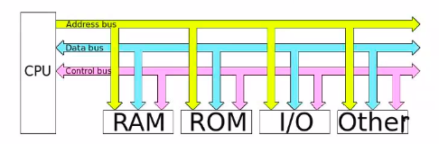
Address bus carries only addresses, data bus carries only data and control bus carries control signals (RD/WT etc)

### Data Bus:
- Carries data:
	- No difference b/w 'data' and 'instruction' at this level
- Width of the bus is very important -> wider bus means more info transferred in lesser time

### Address bus:
- Identify source or destination of the data
- Bus width determines maximum memory capacity of system.
	- 16 bit wide bus => 2^16 memory space

## What do Buses look like?
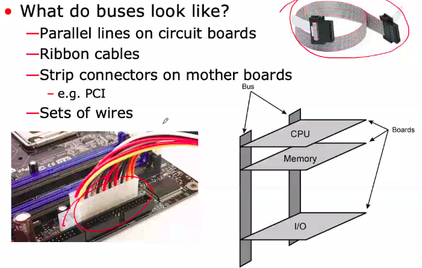

