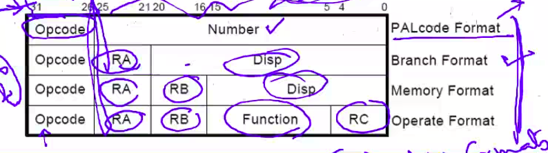

# September 9, 2020

## Bus Arbitration
- The bus is connected to both the memory as well as the CPU. Bus arbitration decides who should be favoured when both CPU and memory make a request for the bus at the same time.
- Arbitration might be centralised or distributed
	- centralised:
		- single hardware device controlling bus access
			- bus controller / arbiter
		- may be part of cpu or separate
	- distributed
		- see slides
### How does CPU decide whether a piece of information is data/instruction/address?

p long explanation

> n bits -> 2^n possibilities

## ISA
very very important

## How to instruct a computer?
PROGRAM -> compiled to -> EXECTUABLE -> executes -> OUTPUT

- Compiling is converting high-level code into formats that the computer understands.

## The Language of Instructions
- Humans can understand high level languages, but computers cannot. They only understand the simplest of instructions.

Syntax v. Semantics: Grammar v. Definitions

The semantics of the instructions supported by a processor is know as the instruction set architecture

## Instruction
- Basic element of the HW/SW interface
- opcode: instruction (add, subtract, etc)
- operand: what to perform the instructions on? a, b, 5, etc.
- There are multiple instruction formats.(interrupts, exceptions, signals, etc).

Displacement values - where to jump? Which instruction to perform next?