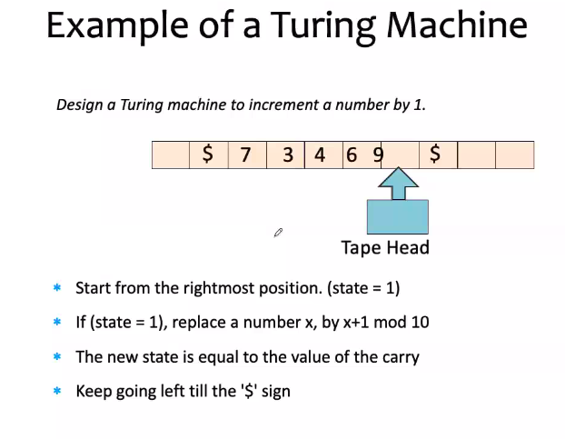
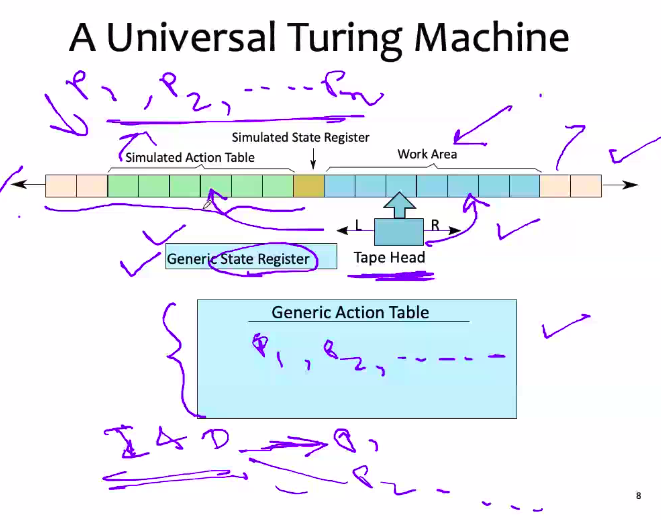
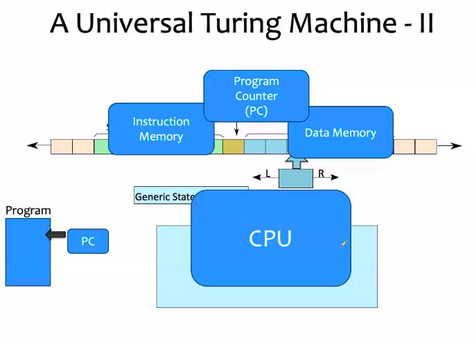
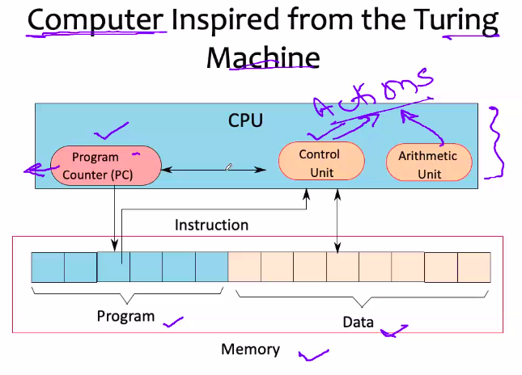

# September 14, 2020

In the last class, we talked about the turing machine. It is invented by alan turing. He is known as the father of CS => IT is a theoretical machine. In principle, it can solve all kinds of problems.

The turing machine has an infinite tape which stores symbols in cells. These symbols can be accessed by your tape head, which could move to either left or right and during the movement, it reads/writes data to the tape.

It stores the actions in a table called the action table in a sort of control instructions that are given to the system. Every instruction is given here, which constitutes of an action. It could include the state code - operation to perform - and the symbol to be written, and whether to move the tape head to the right or left.

The state register stores the current state of the system. (Where the tape head is pointing,what operation it is performing, read or write, etc).

Soo, uhh let's quickly summarise. What happened to thiiiissss? 

If we have to design a turing machine to increment a number by one: 73469 -> 73470

- This machine is extremely simple and extremely powerful.

### Universal Turing Machine
An important thing to be noted is that a turing machine takes an input, it performs specific operations defined in the action table and give ouput.

We have to define several turing machines to have all the different functions, which is chaotic.

Instead of that, we can design a universal turing machine which will take not only the data as input, but also the instructions as input. **ROBUST AF**

- A UTM needs to have an action table, state register and tape that can simulate any arbitrary turing machine.
- Generic action table stores all instructions, actions and data for all programs.

work are => Data memory
action table => CPU
actions stored in the tape => instruction memory

### Elements of a Computer

Let us take an infinite tape having some data in it (anything, doesn't matter). Now, we can define turing machines in such a way that.. we define certain states for it. Just I'm trying to simplify how the turing machine can be really understood with a simple example.

- We define a certain state and assume that due to some operation/action, the tape head will move from state Q0 to Q1 with a condition that whatever value there was in the cell with zero.

Youtube se dekh lo

## Assembly Program

We have also studied that ISA actually converts your assembly instructions (ISA form) to machine understandable form. Here, the given ISA form is aka assembly program. 
- It becomes challenging in multi-processor environment.

### What is assembly language?
- We want to convert high level languages to machine form and in the process there is an intermediate stage required, which maps high level language to your ISA. 
- The term 'assembly language' refers to a famiily of low-level programming languages that are specific to an ISA. THey have a generic structure that consists of a sequence of assembly statements.
- Typically, each assembly statement has (1 an instruction code (2) a list of operands

- From the perspective of a programmer, we want to write high level programming language. However, if we want to do something that is not possible with high level language, we can use assembly language.
- We are seeing words on our screen. Is there any way that we can replace the entire text with all zeros?
- When we use clear command in terminal, it clears the screen. How does that work though? 
- There is a array or a buffer connected to every device. If I can clear this buffer, and then write all zeroes, the screen will be blank. 
- Every device is having a driver program. The driver program maintains the buffer, which maintains a buffer (local memory). 
- Every device has a pre defined starting address (noted in hexa decimal code). Google the starting addresses of screen/mouse/keyboard, etc.
- We can store those address in pointer variables.
- So there would be some clear screen instruction to clear the buffer. However, this might not be possible with python, c++, etc, but, by knowing assembly language, we can clear the screen

### Assemblers
Assemblers are programs that convert programs written in low level language to machine code.

Exampkes:
- nasm, tasm, masm for x86 architectures
- One a linux system, try:
	- what?	

From a hardware designers' perspective, they will design what to build 

- Let's come back to the VN model. THere are several registers. Let's see the different types of registers. We'll start now designing an ISA, which requires a through knowledge of registers and the model. How many registers??
- ISA is a compression of all the instructions. Okay and these instructions are having some format, and there is an opcode, and operands. The operands *can* be in the registers if required. 
- Let us try to first understand how these registers can be used in the design of ISA, and how to address these operands and registers together.
- Later we will slowly move to understand one component after the other.

### View of Registers
- How many registers is the device supporting?
- More number registers => ISA can accommodate more operands. 
- Registers -> named storage locations
	- Every register location is having some name
	- in ARM: r0, r1 ... r15.
	- in x86: eax, ebx, ecx, edx, esi, edi
- registers with some special functions:
	- program counter
	- return address
	- instruction register

### View of Memory
- Memory:
	- one large array of bytes
	- boxes drawn vertically/horizontally, and each box stores a certain value. Every location is expected to have some address.
	- The address of the first location is usually denoted by 0,1, 2.... but practically, they have actual codes, we use 0, 1, 2 etc for our convenience.
	- The program is stored in a part of the memory
	- The program counter contains the address of the current instruction. Entire memory will have several programs 

Maybe we'll stop today in the interest of time.. and uhh.. after now any questions? Otherwise we'll stop it

**Shashank**: Driver programs run the hardware, so they must be harware specific right?
**Peddoju**: yes

**Shashank**: But when we installed linux, we had to install the drivers all over again. 

**Peddoju**: Oh yeah yeah yeah of course, they are OS specific too. All the peripherals, your linux OS sees them as a file, while the windows OS sees them as a device. So definitely, the device drivers the point I amtrying to convince you is that the device driver has to be specific to a peripherals. And these drivers at the top level may again be different for different operating systems.
