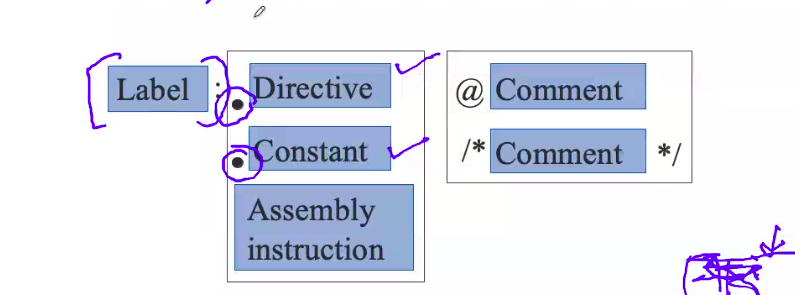

# September 16, 2020

In the last class we discuess about assembly programming, we took a VN models as a base model and tried to write an ISA for this architecture.

We have already defined what is an ISA, and we have defined Assembly Language, and we have also learned why assembly language is important. 

Assembler is that program which converts low level languages to high level languages.

And I asked you to list the assemblers for different types of ISAs

And in the discussion we have also said that registers are named storage locations. The names of these registers varies from architecture to architecture.

Machine specific registers:
- Control the machine such as speed of fans, power control, etc
- Read the on-chip temperature

Yesterday I have also briefed that memory is a large one dimensional array and typically each location stores the number or character in the form of zeroes and ones. Each location is having value inside each box, but typically we do not represent this by address but we use some sort of indexing. It doesn't start from 0, we just use it for our convenience.

> Program counter is managed by the control unit.

## Storage of Data in Memory

Typically the data is stored in the memory I mentioned apart from the programs. For example if you consider the C language it stores one byte for the char, 2 bytes for short, 4 bytes for int, etc.

So data type defines how many locations it needs to store on unit of data.

- Little endian representation (ARM, x86) ->  The LSB is stored in the lowest location.
- Big endian representation -> (Sun systems, IBM PPC) -> The MSB is stored in the lowest location.

e.g. : to store 0x87654321:

#### Big endian
|0|1|2|3|
|-|-|-|-|
|87|65|43|21|

#### Little endian
|0|1|2|3|
|-|-|-|-|
|21|43|65|87|

## Storage of Arrays in Memory
- Single dimensional arrays. Consider an array of integers: a[100]. It is stored normally, no doubt.
- For 2-D arrays, each row is stored one after the other. 
- Each integer is stored in either a little endian or big endian format.
- Ways of storing n-dimensional array:
	- Using row-major configuration
	- Using column-major configuration

### Row Major vs Column Major
- Row major:
	- C, Python
	- Store one row, then next row, and so on
- Column major:
	- Matlab
	- Store one column, then next column, and so on 

## Generic Instruction Structure

- Label 
	- Identifier of a statement
	- Like goto: in c++ and c
	- Note the colon.
- Directive -
	- Tells the assembler to do something like declare a function 
	- Like #define in c++. Tells compiler to first see those then move on to code.
	- Note the decimal point.
- Constant
	- Declares a constant
- Assembly Instruction
	- contains the assembly instruction, and operands
- Comment
	- textual annotations ignored by the assembler
Comments are not seen by compiler, just for us to see

## Assembly File Structure: GNU Assembler

- file name
- set of instuctions
- and so on..

Divided into different sections (instruction sets and data sets)

### Structure of an Instruction
Each instruction has an opcode and an operand. Okay
And here the instruction refers to your opcode and there can be several operands following the opcode

And these operands can be directly specified with some constant data.

Operands can be fetched in three ways:
- Constants
Let's say you are using instruction add.
You can say
	 ADD C 10, 20	=> C = 10+20
	 This representation is called immediate representation, both operands have a constant value. 
- Registers
Instead if I said:
	ADD R1, R2, R3 => R1 => R2 + R3
	*Does this have a special name?*
- Memory
	[addr]

## Types of Instructions
- **Data processing** instructions
	- add, subtract, arithmetic, logical, relational, etc
- **Data Transfer** instructions
	- Moving the data between registers and memory locations. 
- **Branch** instructions
	- Branch to a given label
- **Special** instructions
	- Interact with peripheral devices, other programs, etc

## Nature of Operands
Typically if the instruction takes n operands, then it is said to be n-address format.
If it doesn't take any operands, it is zero-address format. If it takes one operand, it is one-address format

Example: add r1, r2, r3 (3 address format)
r1 = r2 + r3

Based on this background, we will try to define addressing modes.

It is a method of specifying and accessing an operand in an assembly statement is known as the addressing mode.

## Register Transfer Notation

- r1 <- r2
	- Transfer the value of r2 into r1 (makes a copy of it)
- r1 <- r2 + 4
	- immediate address 4 and take the value of r2, add 4 to its value, and store in r1
- r1 <- [r2]
	- access the memory location that matches the contents of r2. Get the value of r2. Use that value as a memory location, and access the value at that memory location.

## Addressing modes
There are different ways of **accessing** operands and these are known as addressing modes
- Immediate accessing mode
	- V <- 4, 8, 0x13
- Register direct addressing mode
	- V <- r1
	- The registers are actually having the values, and the value is copied
- Register indirect
	- V <- [r1]
	- Register has the address not the value. It is indirectly giving the pointer as the value, which will then get the value from that address
- Base offset
	- V [r1 + offset], eg 20[r1] (V <- [20+r1])
	- e.g. getting value from the array.
	- In thi process, we must undersatnd that when you are representing the base offset method, we can write it in 4 ways:
		- [r1 + 20] 
		- [20 + r1]
		- r1[20]
		- 20[r1]

In c++, to access an array, we an write it as:
a[i], or *(a+i); NOICE

but i[a]???

- Base-index-offset
	- V <- [r1+r2+offset]
	- 100[r1, r2] (V <- [r1+r2+100])
- Memory Direct
	- V <- [addr]
	- Fetch value from given address
- PC Relative
	- V <- [pc + offset] **(DOUBT)**

## SimpleRISC
- Contains only 21 instructions
- Simple RISC ISA
- Design a simple binary encoding and then implement it

Reading Assignment: LEARN WHAT IS Bi ENDIAN
WTF IS Bi Endian

How do these processors support bi endian? What is the peculiarity

## Registers
- SimpleRisc has 16 registers
	- r0 to r15
	- r14 and r15 are reserved for stack pointer and return address register
- View of Memory
	- Von Neumann model
	- One large array of bytes
- Special flags register

## *mov* instruction
In this case we write:

|Instruction | What happens |
|-|-|
| mov r1, r2 | r1 ,- r2|
| mov r1, 3  | r1 <- 3 | 

SimpleRisc has 6 arithmetic instructions
add, subtract, multiply, divide, modulo, cmp (compare)

compare sets flags

## Examples of arithmetic instructions
- Convert the following code to assembly

| Arithmetic | Assembly Code |
|--|--|
| a = 5 | mov r0, 5 |
| b = 3 | mov r1, 3 |
| c = a+b | add r2, r0, r1 |
| d = c-3 | sub d, c, 3 |

