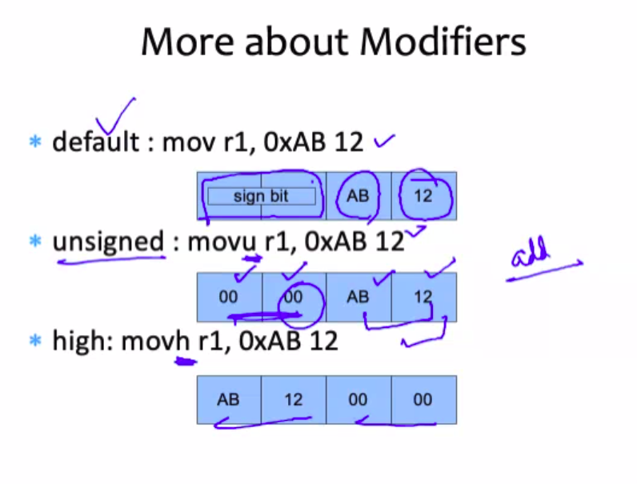

# September 17 2020

flag.E = 1 => equality and flag.GT=1 => Greater than

addi -> add immediately
If you recollect we have mentioned two important things in the last class:
- Specification
	- How you are specifying instructions
	- opcode
- Access
	- How you are accessing the operands in the instruction.
	- operand

## Compare Instruction
- Compare 3, and 5, and print value of the flags

| Arithmetic | Code |
| - | - |
| a = 3 | mov r0, 3 |
| b = 5 | mov r1, 5 |
| compare and a b | cmp r0, r1|

Finally: flags.E = 0, flags.GT  = 0  which indicates that 3<5

Similarly:

| Arithmetic | Code |
| - | - |
| a = 3 | mov r0, 3 |
| b = 5 | mov r1, 5 |
| compare and a b | cmp r1, r0|

Finally: flags.E = 0, flags.GT  = 1  which indicates that 3<5

**Q)** Write assembly code in SimpleRISC to compute 31/29 - 50 and save the result in r4

|  Arithmetic | Code |
| - | - |
| a = 31 | mov r0, 31 |
| b = 29 | mov r1, 29 |
| c = 31/29 | mov r1, 29 |
| ans = 31/29 - 50 | sub c, 50|

## Logical Instructions

| a | b |
| - | - |
| and r1, r2, r3 | r1 <- r2 & r3 |
| or r1, r2, r3 | r1 <- r2 | r3|
| not r1, r2| r1 <- ~r2 |

## Shift Instructions
- Logical shift left (lsl) (<< operator)
	- 0010 << 2 is equal to 1000
	- << n is the same as multiplying by 2^n
- Logical shift right 
	- 1000 >> 2 = 0010
 	- >> n is the same as dividing by 2^n

**Example**
- Compute 101 * 6  and 102*7.5 by using shift operands:


## Load-store instructions

| | |
| - | - |
| ld r1, 10[r2] | r1 <- [r2 + 10] |
| st r1, 10[r2] | [r2 + 10] <- r1|

Load : load the value present in the address r2 + 10 into register r1.

Store : store the value present in register r1 into address location r2 + 10

Most of the sources and languages follow the same syntax as above.

**Example**
Translate:
```
int arr[10];
arr[3] = 5;
arr[4] = 8;
arr[5] = arr[4] + arr[3];
```
into SimpleRISC:
```
/* assume base address is r0 */
mov r1, 5
st r1, 12[r0]
mov r2, 8
st r2, 16[r0]
add r3, r1, r2
st r3, 20[r0]
```
**NOTE: 4*sizeof(int)** that is why we write 12[r0] an not 3[r0] etc..

## Branch Instructions
- Unconditional branch instruction

|b .foo | branch to .foo|
|-|-|
```
add r1, r2, r3
b .foo
...
...
.foo:
	add r3, r1, r4
```
Jump straight to .foo

## Conditional Branch Instructions

| | |
|-|-|
| beq .foo | branch to .foo if flags.E = 1 |
| bgt .foo | branch to .foo if flags.GT = 1|


**Example:**
If r1 > r2, save 4 in r3, else save 5 in r4:


**Example II**

Compute the factorial of the variable num:

In C++:
```
int prod = 1;
int idx;
for(idx = num; idx > 1; idx--){
	prod = prod * idx;
}
```

In SimpleRISC:
```
mov r1, 1
mov r2, r0
.loop:
	mul r1, r1, r0
	sub r2, r2, 1
	cmp r2, 1
	bgt .loop
```


**HOMEWORK**
Try to write sorting programs in SimpleRISC

## Modifiers
- We can add modifiers to an instruction that has an immediate operands
- Modifier:
	- default: mov -> treat the 16 bit  immediate as a signed number(automatic sign extension)
	- (u): movu
		- treat the 16 bit immediate as an unsigned number.
	- (h): movh
		- left shift the 16bit immediate by 16 positions


Your ISA should clearly define what kinds of modifiers your are trying to implement in the code

## Mechanism
- The processor immediately converts a 16 bit immediate to a 32 bit number
- It uses this 32 bit number for all computations

If I add two 16 bit numbers, we might not be able to store the result in a 16 bit register.




