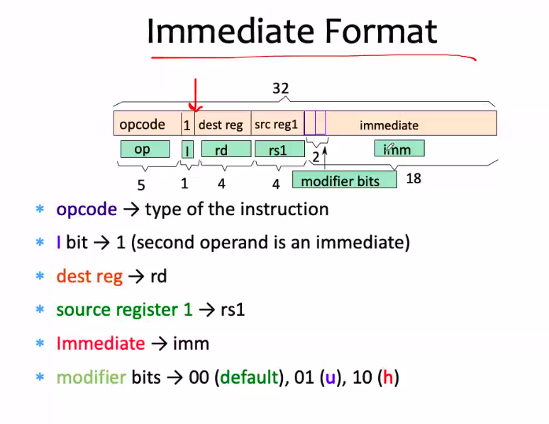

# September 23, 2020

### *nop* Instruction
Just move on
## Encoding Instruction
- Encode the SimpleRisc ISA using 32-bits.
- We have 21 instructions. Let us allot each instruction a unique code (**opcode**).

So all the 21 instructions now we have listed out here with their code. Now what the computer will do is with the 32 bit instructions:

- First 5 bits: what to do? (From table above)
	- If 00000: add instruction
- If it's add, then you need to have three registers represented next => Remaining 27 bits.

## 0-Address Instruction
- **nop** and **ret** instructions
- If nop, then continue execution from the next step, ignore the operands.
- If ret, then go back to where you came from

## 1-Address Instructions
- call, b, beq, bgt
- Use the **branch** format
- Fields:
	- 5 bit opcode
	- 27 bit offset (**PC Relative addressing**)
	- Since the offset points to a **4 byte** word address
	- The actual address computer is **PC + offset*4**

## 3-Address Instructions

- Generic address instruction:
	- <opcode\> rd, rs1, <rs2/imm>
- Use the **I** bit to specify if the final register is rs2 or imm
- **I** bit comes just after opcode 

## 2-Address Format
- cmp, mov, not
- Either destination register or one of the operand registers will be missing
- **I** modifier must be there to specify whether it's rs2 or imm register.

## Load and Store Instructions
- ld, rd, imm[rs1]
- rs1 -> base register
- Subsequently, control unit gets value from base register.
- It uses the immediate format. It is the destination register, source register, and immediate values are there, and the actual flag for indicating whether it's rs2 or imm
- you please a recollect this slide, what we have discuss

>So that's why it is strange, in a sense that the destination register we are using it as a source here.

## Store Instruction

**x-x-x-x-x-x-x-x-x-x-x-x-x-x-x-x-x-x-x-x-x-x-x-x-x-x-x**
