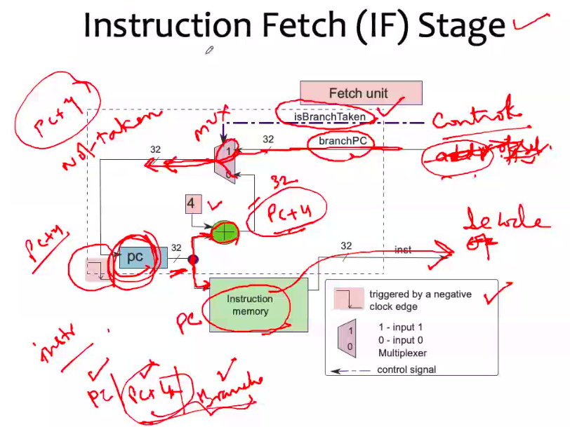

# September 24, 2020
- Fetch cycle 
- Decode cycle 
- execute cycle 
- memory read 
- registers write

So in your assembly code you have your label, and your branch will return back to the label in the sense that in the main program somewhere you have executed a function. You go to the function's storage location, execute the function, and come back to the labelled register.

Instructions
- PC -> Function call -> Next is PC+4
First, PC+4 is stored in r15, the return address register. After all instructions of function are executed, it goes back to PC+4

## PRocessor Design

The aim of processor design is to implement an ISA. In our example, we will implement SimpleRISC ISA.

So the goal is to process the final format of instructions and minimise the time taken to execute the instructions. Number of instructions and space taken should be fewer.

As we've discussed in the previous slide, the process is divided into several stages and we have to design each stage separately.

### A processor's tasks are divided into stages
| |
|-|
| Instruction - IF |
| Operand Fetch (Decoding) - OF |
| Execute - EX |
| Memory Access (Memory Read) - MA |
| Register Write - RW |

In some architecture designs, instruction fetch and decode are combined int a single stage. (Depends on architect)

- Instruction Fetch
	- 
- Operand Fetch
	- Decode the instruction (break into fields)
	- Fetch the register operands from the register file
	- Compute the branch target(PC + offset)
	- Compute the immediate

- The Execute Stage
	- This stage can perform logical and arithmetic operations
	- It also contains the branch instructions (beq, bgt, etc)
	- Flags are updated

I'm just trying to remind you that these are the steps that happen in each stage and accordingly we have to design the stages

- Memory Access Stage
	- Interface with a memory system
	- Executes a load or store
	
- Register Write Stage
	- Writes to the register file
	- In the case of a call instruction, it writes the return address to register, **ra** = pc + 4

