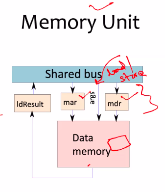

# October 1, 2020

In the last class we have discussed the general control unit design and we mentioned the hardware control unit. We also understood the hardware control unit is having a weakness (fixed ____ ) which is not flexible.

In some sense the hardware logic is one side it is fast in implementation but on the other hand it is not flexible. So if I wanted to introduce a new set of instructions or think about 

What we have discussed is that there is a control unit. There is a hardwired set of instructions. 

## Micro-programming
If we implement every instruction instead of fixed logic with logic gates. 

For eg in case of load/store instruction, we have fixed logic. It cannot have any variations in it. If we need to modify it later, then we have to take it apart and completely modify it -> this would need modifications in CU, which would consequently require changes in the CPU.

This will complicate the design activity of any system. We wanted flexibility in implementation so that any modifications that need to be made can easily be made. 

This is where micro programming comes in.

A program is a set of instructions. Out of this set of instructions, there are sub-instructions within a single instruction.

For example, the store instruction is defined by further micro instructions. The store instruction can be modified by changing its micro instruction set. 

This is the essence of micro programming. We are trying to create a micro assembly program which is having a subset of instructions which we can change at any time with convenience.

Okay
Now

The next important thing is uhhhh okay let me re emphasise what we have studied. So idea of micro programming is to implement instructions as dedicated software routines instead of fixed hardware routines.

So why micro programming?
- Usually when we want to make complex instructions or change behaviour of existing system, or even fix bugs, we wouldn't want the system to be hardwired because it is difficult to reconfigure.

## Micro programmed Data Path
- Every single instruction that we have studied (21 instructions in SimpleRISC) has micro instructions. 
- So now we have to define a system which has to execute micro instructions.
- So we introduced a couple of additional registers.
- We have micro program counter and micro instruction memory to store the set ot micro instructions.
- Similar to the Fetch Decode Execute cycle, there is a similar implementation here.
- Fetch Decode Execute Micro instructions and store values temporarily in the micro instruction memory.
- We have to clearly define how the micro instructions are written (what micro instrutions are possible).
- All these aspects now we have to understand from this like uhhh like micro programming processors

> These processors are called micro-programming processors, as opposed to the hardwired processors mentioned before.

- Expose all the state elements to dedicated system software that is called *firmware*. 
	- So now we are trying to mention that there is a firmware which is some sort of software which includes some set of micro instructions which we can say routines. 
	- These sub programs run the instruction sicle for micro instructions.
	- Firmware comes between hardware and software. 
	- Software ~ instructions
	- Hardware ~ Hardwired implementation
	- Firmware ~ simplifies 

### Fetch Unit

The program counter accesses the instruction memory. Some people will use PC and IR at programming level and pc and ir at micro level.
It's up to you how to understand it. Don't get confused by the different books.

> SimpleRISC is faster because it is hardwired. But more difficult to handle because it is hardwired. 

BIOS also some sort of firmware, but it cannot be modified. In case of Control Unit implementation of micro programming, it can modified.

**Shashank**: Could you pleeassseeeee give us an example of firmware softwares
**Peddoju**: We will talk about that. Don't worry about that. Let's talk about how it works first. Ask me again after two-three classes

## Decode Unit

You have to decode every bit by selecting the corresponding bit line from it. Still there is some hardwired implementation. But uh there is still a lot of flexibility in implementation.

We are defining a new set of registers
- l, rd, rs2, immx, and branchTarget

## The Register File

If it is a read operation then the data is retrieved from the register, else, it will store the data in the registers.
regSrc -> ID of register (address)
regData -> WRite
regVal ->Read

## ALU

Another inmportant unit which is execution unit. If you remember we have seen branch and ALU and flags are the three primary operations of your computing instructions.

- Now in the last class ALU takes two arguments A and B right and produces some output what you call as ALU result. 
- And the A B are the operands and ALU result is the output. 
- You also need to provide another input to specify what kind of operation it is. So those arguments will provide that details.
- Let's define micro registers A and B which store operand 1 and operand 2. Operand 1 is a register and Operand 2 may be a register or immediate value.
- We are assuming that there are a couple of micro registers where register / immediate values are stored. 

## Memory Unit
If you recollect we have studied MDR and MAR in assembly programming. Now we are talking about mdr and mar. So functioning-wise it is the same though.

## Micro-programmed Data Path 
PC fetches an instruction into micro pC. The micro PC analyses the instruction and figures out the required values and using these values like based on the argument, action is performed (ALU operation, load store, etc). 
	That's how the micro control unit actually functions, with the exception that the operations were previously hardwired but now it is defined by small program codes. (micro programs). 

We will now study how these micro registers can be used to study micro programs.

## Internal Registers

