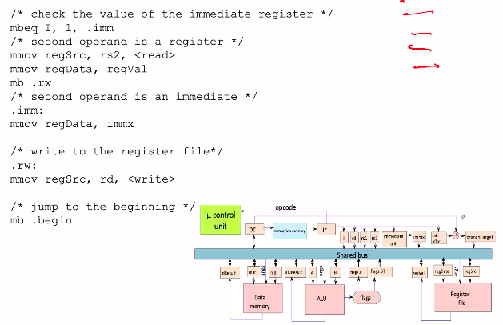

# October 3, 2020
We are trying to understand architecture by taking simplerisc as an example.

Every program that we execute, it has several instructions and these instructions themselves can be designed in a way that they have micro instructions.

We are trying to understand how to design these micro-programs such that these instructions can be redesigned whenever we want. The structure must be easily modified.

Unlike micro-programming architecture, hard wired architecture use predefined static logic. Whenever there is a firmware update in micro-programming architecture, you simply use the new set of instructions.

## Internal Registers


## Micro-instructions
### General Instructions
- mloadIR (m - load - Instruction Register)
	- Loads the instruction register (ir) with the contents of the instruction
	- Part of fetch cycle
- mdecode
	- Waits for 1 cycle. Meanwhile all the decode registers get populated.
	- Part of decode cycle
- mswitch
	- Sends the instructions based on the loaded values for execution.Loads the set of micro instructions corresponding to a program instruction.

### Move Instructions
- mmov
	- r1, r2
	- r1, r2, < args > : r1 <- r2, send the value of args on the bus
- mmovi
	- r1, < imm >
		- Move immediate value into r1


### Add and Branch Instructions
- madd r1, imm, < args >
	- r1 <- r1 + imm
	- send < args > on the bus
- mbeq r1, imm, < label >
	- if (r1 == imm), upc = addr(label)
	- upc = micro program controller
- mb < label >
	- upc = addr(label)
	- Move without a condition

### Summary


## Implementing Instructions in Microcode
### The microcode preamble
A program has several instructions and each instruction has several micro instructions.
Each micro instruction has a preamble.

Whenever a micro instruction gets executed it must start with this preamble:

```
.begin:
mloadIR     % Load the program counter
mdecode     % Decode the instuction
madd pc, 4  % Increment progarm counter
mswitch     % Switch to the first microsintruction in the microcode sequence of the prog. instuction
```
Even if there is a branch instruction, `madd pc, 4` is called. And further down if there is a branch instruction, it overrides the PC with the correct address.

## 3 Address Format ALU Instruction


## The mov Instruction

Micro instructions of mov instruction

## The not instruction


## The cmp instruction


## The ld instruction


### Homework:
- Change the call instruction 
- Vertical vs/ Horizontal Microprogramming
