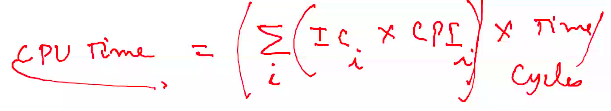
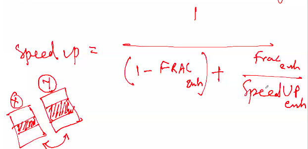

# October 7, 2020
CPI = Clock Cycles per Instruction
How many clock cycles are required for each instruction?
- Fetch Cycle
- Decode Cycle
- Execute Cycle
- Write Cycle

`CPI = (#instr/program) times (cycles/instruction) times (clock cycles / unit time)`

> Iron Law of Performance 👆

Q)  There are 50 billion instructions. 

| # of instructions | Type of instruction | CPI |
|-|-|-|
| 10 billion | Branch | 4 |
| 15 Billion | Loads | 2 |
| 5 Billion | Stores | 3 |
| Rest | Add instructions | 1 |

If you have clock running at 4 GHz, what is the execution time?

Ans -> 26.25 seconds

### Amdahl's law
One of the popular formulas which gives a message to indicate the speed up part of the program. (Theoretical speed up). You may not practically be able to achieve that speed up, but when you are comparing two machines you consider the relative improvement)

Fraction of enhancement is % of original execution time that is affected due to this enhancement(practical)

Q) There are 50 billion instructions, but this time clock freq is 2 GHz. Suppose that there is a branch instruction which has had an improvement. Earlier it used to take 4 CPI, now it takes 2 CPI, which is faster. Integer arithmetic involved which takes 40% of .... see Dinku/Shashank's notes
