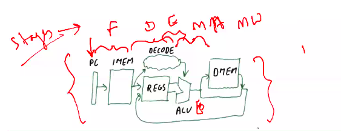
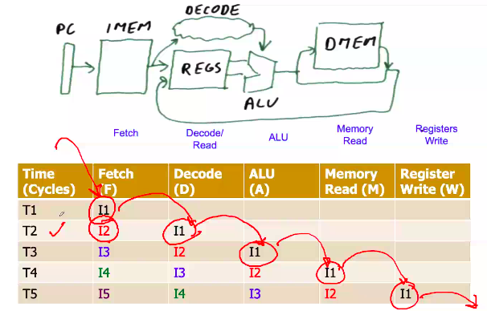
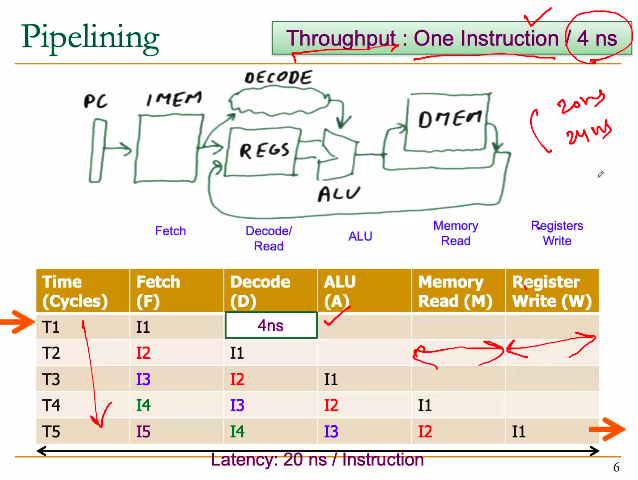
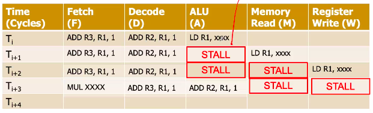
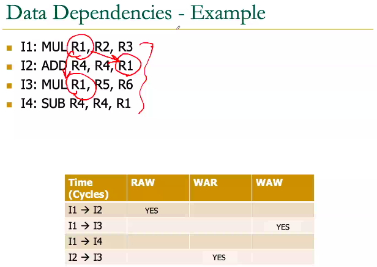

# October 8, 2020
- Performance factors:
	- Speed up (Amdahl's Law)
	- Throughput
	- Latency
	- 


Let us quickly understand....

If execution of one instruction takes 20 nanoseconds of time, then instruction 2 and 3 and all the rest instructions take the same amount of time...

**What is the pipeline concept?**
Already discussed previously


Latency: 20ns/instruction



### Stalls
For some reason where a glitch / exception occurs, or the values are not available, and it cannot continue to the next instruction immediately, it will lead to a waste of an execution cycle. It is called a stall.



### Flushes
If there is a branch instruction the PC has to now point to a different location than PC+4. So here the jump instruction will provide the corresponding address. 

The next instruction would already be loaded. But since we need to go to a different instruction, the already loaded instruction must be *flushed*

## Control Dependence
- JUMP
	- Instruction after JUMP are control dependent.
	- If true then jump else son't types

```
ADD R1, R1, R2
BEQ R1, R3, Label  % control dependent
ADD R2, R3, R4
SUB R5, R6, R8

Label:
	MUL R5, R6, R8
```
### Branch Predictions
In above code, in pipelining, the system must have already loaded ADD and SUB instructions, and to change it to MUL instruction, we must flush it. That requires extra instructions.

Instead, we could predict the outcome of the branch decision and load MUL before-hand.


Statistics say that:
In a 5 stage CPI:
- 20% of instructions are branch instructions
- >50% of branches are *taken* (i.e. will branch)
	- we will be fetching the wrong instructions

> IMPORTANT ASSIGNMENT: STUDY DIFFERENT TECHNIQUES FOR BRANCH PREDICTION

CPI = 1 ( ideal case ) + ....

## Data Dependence
- RAW (Read After Write)
	- aka Flow
	- aka True
```
ADD R1, R2, R3
SUB R7, R1, R8
```
- WAW (Write after Write)
	- aka Output
```
ADD R1, R2, R3
SUB R7, R1, R8
MUL R1, R5, R8
```
- WAR
	- aka Anti-
```
ADD R1, R2, R3
SUB R7, R1, R8
MUL R1, R5, R8
```

gist: 
&nbsp;There are different stages in each cycle, and during pipelining, if read step of R7 in SUB occurs before write step if R1 in ADD, then problem.


