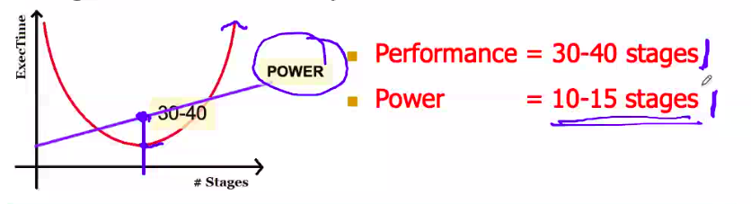
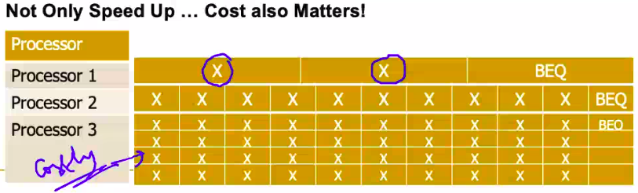

# October 14, 2020

## Control Dependence
- Which instruction is going to be fetched after the beq instruction? One fix could be to *predict* the branch that is going to be taken

## Data Dependence
- RAW, WAR, WAW
- Done in last class :)

## Dependencies and Hazards
- If any instruction leads to incorrect execution, it is called a hazard.
- Some dependencies cause incorrect execution -> must avoid 
```yaml
I1: ADD R1, R2, R3
I2: MUL, R1, R5, R6
% Write after Write -> NO HAZARD because it isn't being read in between
```

| Time (Cycles) | Fetch (F) | Decode (D) | ALU (A) | Memory Read (M) | Register Write (W) |
|-|-|-|-|-|-|
| T<sub>i</sub> | | | | | | |
| T<sub>i+1</sub> | | | | MUL | ADD |
| T<sub>i+2</sub> | | | | | MUL |

--- 

```yaml
I2: MUL R1, R4, R5
I3: SUB R4, R6, R7
% Write after Read -> NO HAZARD because R4 is being read before being overridden
```

| Time (Cycles) | Fetch (F) | Decode (D) | ALU (A) | Memory Read (M) | Register Write (W) |
|-|-|-|-|-|-|
| T<sub>i</sub> | | | | | | |
| T<sub>i+1</sub> | | | | SUB | MUL |
| T<sub>i+2</sub> | | | | | SUB |


By the time R4 is written, it will have been read before

---

```yaml
I3: SUB R4, R6, R7
I4: DIV R8, R4, R9
% Read after Write -> YES HAZARD
```
| Time (Cycles) | Fetch (F) | Decode (D) | ALU (A) | Memory Read (M) | Register Write (W) |
|-|-|-|-|-|-|
| T<sub>i</sub> | | DIV | SUB | | |
| T<sub>i+1</sub> | | | DIV | SUB | |
| T<sub>i+2</sub> | | | | | SUB |
| T<sub>i+3</sub> | | | | | DIV |

Since DIV instruction is getting decoded before SUB instruction (in Ti stage) reaches the write step (Ti+2 stage), so the old value of R4 is being used.

---

```yaml
I1: ADD R1, R2, R3
I2: MUL R7, R4, R5
I3: SUB R4, R6, R7
I4: DIV R10, R4, R8
I5: XOR R11, R1, R7
```

| Time (Cycles) | Fetch (F) | Decode (D) | ALU (A) | Memory Read (M) | Register Write (W) |
|-|-|-|-|-|-|
| T<sub>i</sub> | | XOR | DIV | SUB | MUL |
| T<sub>i+1</sub>  | | DIV | SUB | |
| T<sub>i+2</sub> | | | | | SUB |
|  T<sub>i+3</sub>  | | | | | DIV |

There is no hazard between I1 and I5, however there is a hazard b/w I5 and I2. Because I5 reads the already set value of R7

Instead, you can overcome these hazards in a number of ways:
- Forward the value of R7 to XOR so that it gets the updated value
- Write value forwarded to read value

> To prevent hazard, the difference of steps should be greater than 3


CPI = 1
More stages = More hazards -> CPI increases
						 Less Work / Stage -> Cycle Time decreases

ExecTime = Balance CPI & Cycle Time	// WTF DOES THIS MEAN



## Branch Prediction
- Consider the following instruction:
	- BEQ R1, R2, Label
- Meaning if R1 == R2, then Goto Label (PC=PC+imm) otherwise goto (PC++) next statement
- However, this condition is verified only in ALU
	- By that time, Fetching and Decoding of other two instructions will take place
	- Then flush
- Branch predictor must correctly
	- After guessing, load correct value

## Branch Prediction Accuracy

$CPI = 1 + \dfrac{Misprediction}{\# instructions} \times \dfrac{Penalty}{Midpredictions}$

- $Predictor Accuracy = \dfrac{Misprediction}{\#instructions}$ 
	- What is the percentage of misprediction?
- $Pipeline = \dfrac{Penalty}{Midpredictions}$
	- Where in the pipeline was the misprediction?
	- Approximately, how many cycles did we pay?

- Take an example:
	- 20% of all instructions are Branch instructions

| Predictor | Accuracy | Processor 1 | Processor 2 |
| :-: | :-: |:-:|:-:|
| | | Resolve BEQ in 3<sup>rd</sup> stage | Resolve BEQ in 10<sup>th</sup> stage | 
| Predictor 1 | 50% for Branch <br> 100% for Other | $1+0.5\times0.2\times2=1.2$ | $1+0.5\times0.2\times9=1.9$ |
| Predictor 2 | 90% for Branch <br> 100% for Other | $1+0.1\times0.2\times2=1.04$ | $1+0.1\times0.2\times9=1.18$ |
| | Speed Up ➡️ | $1.15$ | $1.61$ |
- As the number of stages increase, the accuracy of predictor is very important over the depth of the instructions.
- However, we benefit from the depth of the pipelines to improve the speed up. LEss difference in 3rd stage and greater difference in 10th stage

### Yet another Reason!

| Processor | Stage | Predictor 1 | Predictor 2 | Speed Up |
| :-: | :-: |:-:|:-:| :-: |
| | | Not Taken 88% | Better 99% | 
| Processor 1 | 5-Stage Pipe (3<sup>rd</sup> stage) | $1+0.12\times2=1.24$ | $1+0.01\times2=1.02$ | 1.2 |
| Processor 2 | 14-Stage Pipe (11<sup>th</sup> stage) | $1+0.12\times10=2.2$ | $1+0.01\times10=1.1$ | 2 |
| Processor 3|4 inst/cycle (11<sup>th</sup> stage)|$0.25+0.12\times10=1.45$|$0.25+0.01\times10=0.35$|4.14|

**Not only Speed up... cost also matters!**

## Branch Prediction - Approach
- $\text{PC}_{next} = f(\text{PC}_{current})$
- If we can know PC<sub>current</sub> it will be easy to predict
	- Branch or Taken?
	- But, it is not possible
- However, we do know how the PC has behaved in the past
- $\text{PC}_{next} = f(\text{PC}_{current} , history(\text{PC}_{current}))$

> ## Read at least one algorithm on branch prediction
