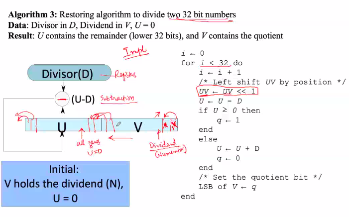
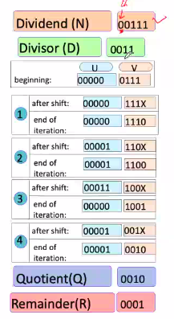

# October 28, 2020

## Division

Let us consider only positive numbers for now
`N = DQ + R`

- Properties:
	1. R < D, R >= 0
	1. Q is the largest positive integer satisfying the equation (N=DQ+R) and property 1


### Reduction of the Division Problem


`N + DQ + R` ==> ***1***

- Q is the quotient and we are working on the division problem of n but numbers.
- If we are taking n bit numbers then each number can be represented with <= n bits.

Q = Q<sub>n</sub>Q<sub>n-1</sub>Q<sub>n-2</sub>...Q<sub>1</sub>
Q = Q<sub>n</sub> * 2<sup>n-1</sup> + Q<sub>n-1</sub> * 2<sup>n-2</sup> +... + Q<sub>1</sub> * 2<sup>0</sup>


N = D * (Q<sub>n</sub> * 2<sup>n-1</sup> + Q<sub>n</sub> * 2<sup>n-1</sup> + ... + Q<sub>1</sub>) + R
N = D * (Q<sub>n</sub> * 2<sup>n-1</sup>) + D* (Q<sub>n</sub> * 2<sup>n-1</sup> + ... + Q<sub>1</sub>) + R

N - D * (Q<sub>n</sub> * 2<sup>n-1</sup>) = D* (Q<sub>n</sub> * 2<sup>n-1</sup> + ... + Q<sub>1</sub>) + R

`N' = DQ' + R` ==> ***2***
`N'' = DQ'' + R` ==> ***3***

....

This process is reduced till we are just left with `R` on RHS.

**DOUBT**: Why do we need to know either Q or R ????


N' = N - D*Q<sub>n</sub>*2<sup>n-1</sup>

Suppose Q<sub>n</sub> = 1:

N' = N - D*2<sup>n-1</sup> &ge; 0 (maximise)

If N' = N - D*2<sup>n-1</sup> &ge; 0  ==> Q<sub>n</sub> = 1 :heavy_check_mark: else Q<sub>n</sub> = 0
If N'' = N' - D*2<sup>n-2</sup> &ge; 0  ==> Q<sub>n-1</sub> = 1 :heavy_check_mark: else Q<sub>n-1</sub> = 0
... and so on, we will get Q

### For example:

4-bit number system ==> n = 4
N = 13, D = 3

- Q<sub>n</sub> (Q<sub>4</sub>): (N, D, n)
&nbsp;&nbsp;&nbsp;&nbsp; N' = N - D*Q<sub>n</sub>*2<sup>n-1</sup>
&nbsp;&nbsp;&nbsp;&nbsp;&nbsp;&nbsp;&nbsp;&nbsp;&nbsp; = 13 - 3 * 2<sup>4-1</sup> = -11 ==> ***Q<sub>4</sub> = 0***

- Q<sub>n-1</sub> (Q<sub>3</sub>): (N', D', n-1)
&nbsp;&nbsp;&nbsp;&nbsp; N'' = N' - D*Q<sub>n-1</sub>*2<sup>n-2</sup>
&nbsp;&nbsp;&nbsp;&nbsp;&nbsp;&nbsp;&nbsp;&nbsp;&nbsp; = 13 - 3 * 2<sup>4-2</sup> = 1 ==> ***Q<sub>4</sub> = 1***

- Q<sub>n</sub> (Q<sub>4</sub>): (N, D, n)
&nbsp;&nbsp;&nbsp;&nbsp; N' = N - D*Q<sub>n</sub>*2<sup>n-1</sup>
&nbsp;&nbsp;&nbsp;&nbsp;&nbsp;&nbsp;&nbsp;&nbsp;&nbsp; = 13 - 3 * 2<sup>4-1</sup> = -11 ==> ***Q<sub>4</sub> = 0***

- Q<sub>n</sub> (Q<sub>4</sub>): (N, D, n)
&nbsp;&nbsp;&nbsp;&nbsp; N' = N - D*Q<sub>n</sub>*2<sup>n-1</sup>
&nbsp;&nbsp;&nbsp;&nbsp;&nbsp;&nbsp;&nbsp;&nbsp;&nbsp; = 13 - 3 * 2<sup>4-1</sup> = -11 ==> ***Q<sub>4</sub> = 0***


> ##Complex problem reduced to a simpler problem

### Iterative Divider

```yaml
Initially: V holds the dividend (N), U = 0
i ⇐ 0
for i < 32 do
	i ⇐ i + 1
	/* Left shift UV by position */
	UV ⇐ UV << 1
	U ⇐ U - D
	if U >= 0 then
		q ⇐ 1
	end
	else
		U ⇐ U + D // Restoration 
		q ⇐ 0
	end
	/* Set the quotient but */
	LSB of V ⇐ q
end
```

**For example:**


