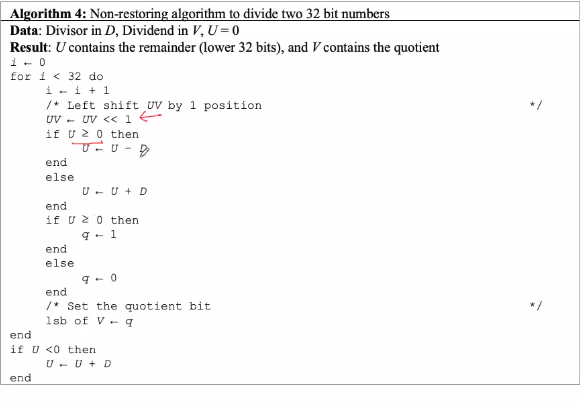

# October 29, 2020
```yaml
Initially: V holds the dividend (N), U = 0
i ⇐ 0
for i < 32 do
	i ⇐ i + 1
	/* Left shift UV by position */
	UV ⇐ UV << 1
	U ⇐ U - D
	if U >= 0 then
		q ⇐ 1
	end
	else
		U ⇐ U + D // Restoration 
		q ⇐ 0
	end
	:
	/* Set the quotient but */
	LSB of V ⇐ q
end
```


## Time Complexity
- n iterations
	- Each iteration takes log(n) time
	- Complexity : `nlogn`

## Restoring vs Non-Restoring Division
- We need to restore the value of register U



Algorithm: Non restoring algorithm to divide two 32 bit numbers

<center> -X-X- End of Integer Operations -X-X- </center>


## Adding Two Numbers (Same Sign)

Normalised form of a 32 bit (normal) floating point number
A = (-1)<sup>*S*</sup> x *P* x 2<sup>*E-bias*</sup>, (1 &le; P &lt; 2, E &isin; **Z**, 1 &le; *E* &le; 254)

Normalised form of a 32 bit (de-normal) floating point number
A = (-1)<sup>*S*</sup> x *P* x 2<sup>-126</sup>, (0 &le; P &lt; 1)


> ### HW: 
> #### Normal and De-Normal representation
