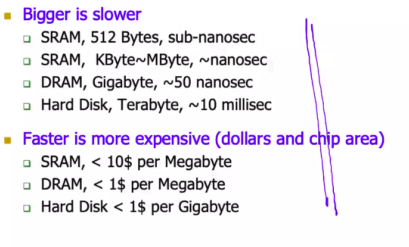

# November 4, 2020

## Memory and Hierarchy Caches
When we have studied the Von-Neumann Architecture we have understood that the memory and processor are the two important things that execute the program, and the instructions are stored in the memory which get executed by the processor, and if need be, it will again access the memory to fetch data.

Typically the memory is assumed to be infinite. There will be no restriction on the amount of data and instructions I store... (for learning mp).

Latency must be low and it should be perfect in control flow execution.

In a typical memory organisation, we have multiple levels of implementation of memory (hierarchy) where you have the regular cores, and each core is supported by the RAM memory. In between the RAM and core, there are several layers of memory like L1, L2, and L3 cache, and then comes your DRAM. Every core of your processor is associated with an L1 cache and closely associated with an L2 cache.

## Ideal Memory
- Zero access time (latency)
- Infinite capacity
- Zero cost
- Infinite bandwidth (to support multiple access in parallel)

The point I am trying to convince you is that ideally a memory system should be designed in such a way that it must have all four properties above. It is, however, not possible, because as the size of the memory increases, the access time also increases, and so does the hardware size and cost. 

## The Problem
- Ideal memory's requirements oppose each other
- Bigger is slower
	- Bigger ==> Takes longer to determine the location
- Faster is more expensive
	- Memory technology: SRAM vs DRAM vs Disk vs Tape
- Higher bandwidth is more expensive 
	- Nee more banks, ports, higher frequence and faster technology.

## Memory Technology

### DRAM - Dynamic Random Access Memory
- Capacitor charge state indicates stored value
	- Whether the capacitor is `charged` --> **1** if `not charged` --> **0** 
	- 1 capacitor
	- 1 access transistor
- You need to be constantly charging the capacitor, because the charge on the capacitor leaks through RC paths.
- Refreshing / recharging is a characteristic property.
- Retention period is one of the crucial factors in the desoing of the memory chips.

### SRAM - Static Random Access Memory
- Two cross coupled inverters store a single bit
	- Feedback path enables the sotred value to persist in the cell for loneger time
	- 4 transistors for storage
	- 2 transistors for access
- Row select will enable the bit line to select the ____ line

### Memory Bank 
- Interleaving (banking)
	- Problem: a single monolithic memory array takes long to access and does not enable multiple accesses in parallel.
	- Goal: Reduce the latency of memory array acess and enable multiple accesses in parallel
	- Idea: Divide the array into multiple bakns tht can be acessed independently (in the same cycle or in consecutive cycles)
		- Multiple banks can be accessed at the same time
		- Accesses to banks can be overlapped
	- How do you decide which info is mapped to which bank?

> ### Please read more types of RAM models / RAM techniques

Cost 
Size
Latency
Bandwidth

CPU <-- Register Files <-- Cache <-- Main Memory (DRAM) <-- Hard Disk

## Locality

- Temporal Locality: If you just did something, it is very likely  you will do the same thing again (soon)
- Spatial Locality: If you did something it is very likely that you will do something similar here.

- A ''typical'' program has a lot of locality in memory references
	- typical programs are composed of loops 
- In loops, you get the instruction from the memory to the cache first, and from there you access them directly from the CPU. They are more prone to the locality of references.
- Temporal: A program tends to refer to the dame memory location many times and all within a small window of time. 
- Spatial: A program tends to references a cluster of memory locations at a time
	- Most notable examples:
		- Instruction memory references
		- Array/data structure references