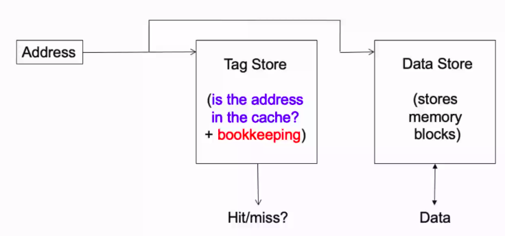
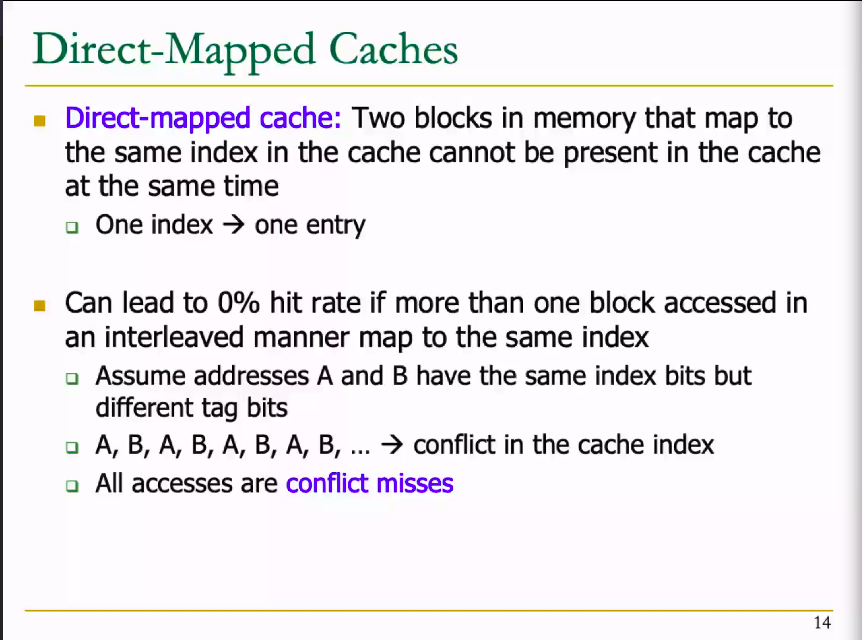

# November 9, 2020

## Cache

Say 8 KB cache, block size is 64 bytes, and 32-bit memory

8KB = 212 B

When you are searching for a particular element - `look up`

We need the 26 bits of tag and 6 bits of offset to identify a particular element.
Tag = Block Address. &rarr; To identify block
Offset = Data Address. &rarr;  To identify data inside the block.

> Address Format

| Tag | Offset |
|-|-|

Typically, the tag and the block, we use two arrays (block array and tag array). Okay and essentially these two must be of equal size (equal number of entries). 

Cache controller: 

Address is split into tag address and the other part is the offset address. So hit rates we have already studied. 

- Cache rate = (# hits ) / (# hits + #misses) = (# hits)/(# access)
- Average memory access time (AMAT):
	- (hit-rate &times; hit-latency

> Can reducing AMAT improve performance?

### Blocks and Addressing the Cache

- Memory is logically divided into fixed-size blocks
- Each block maps to a location in the cache, determined by the index bits in the address
- Say there are 128 blocks for eg
	- 128 blocks require 27 accesses. I need 7 bits for each block.
	- In each block I am referring to a particular data element with 6 bits to identify a particular element.
	- Each block is identified by an index bit.

> 8 bit address

| tag | index | byte in block |
| - | - | - |
| 2b | 3 bits | 3 bits |

- Cache access:
	- index into the tag and data stores with index bits in address
	- check valid big in tag store
	- compare tag bits in address with the stored in tag store

- If the block is in the cache (cache hit), the stored tag should be valid and match the tag of the block.

### Example

Suppose there are different blocks and I have to get an element from the memory to the cache.
The big question is where can I place the element in this cache.

- If cache size is 8KB with block size 64 bytes you have 128 possible blocks where you can store the element.

> Method 1
- Suppose that some blocks are filled, and some blocks are free. You have to check if 0 is having space, 1 is having space, etc.
	- Whenever you have to read the memory, again you have to search the cache.
	- **Full cache traversed** &#8680; Very slow

> Method 2
 
- You could decide the block of storage from the first 7 elements of the data element.
	- Faster reading and writing
	- If the corresponding block is full, you cannot store the element in the block even though there are other empty blocks.

> Modification to Method 2
- Map an element to a set of two / three blocks... 

