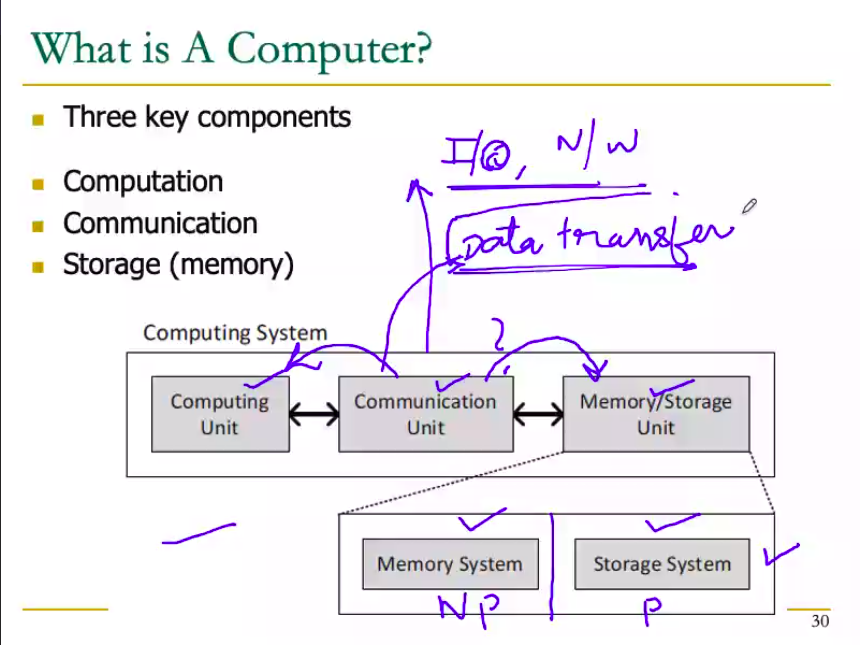
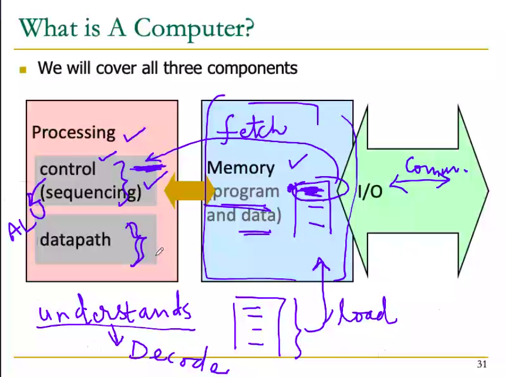
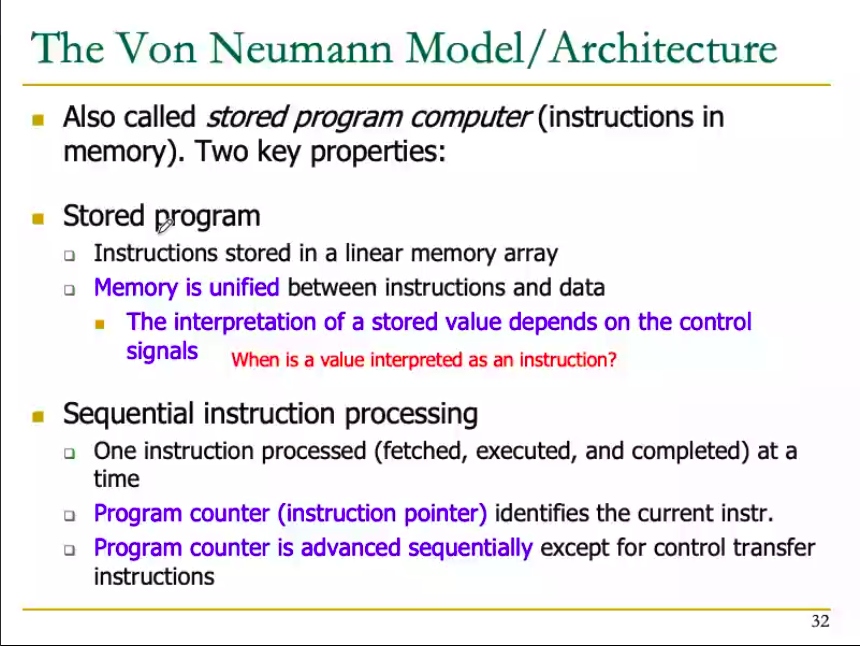
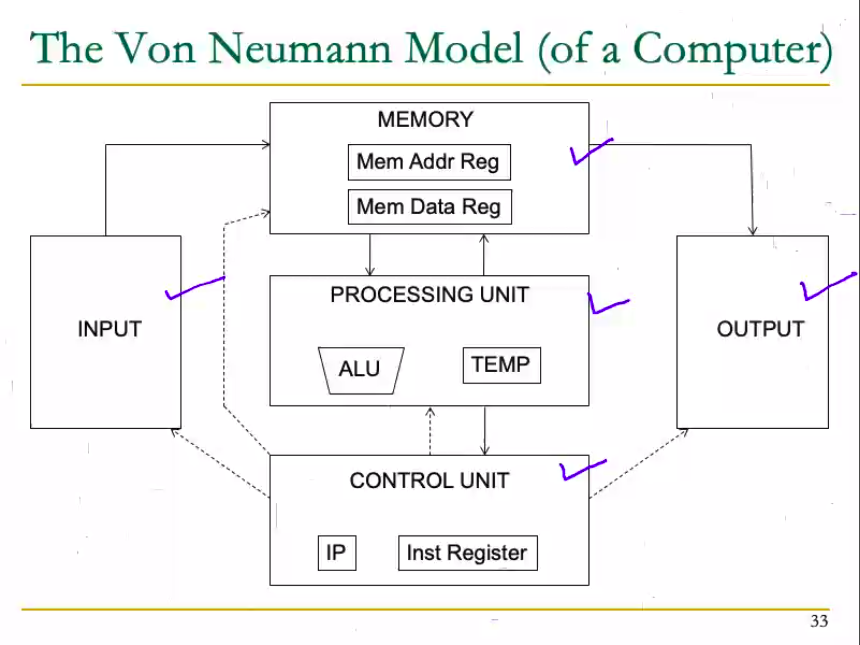
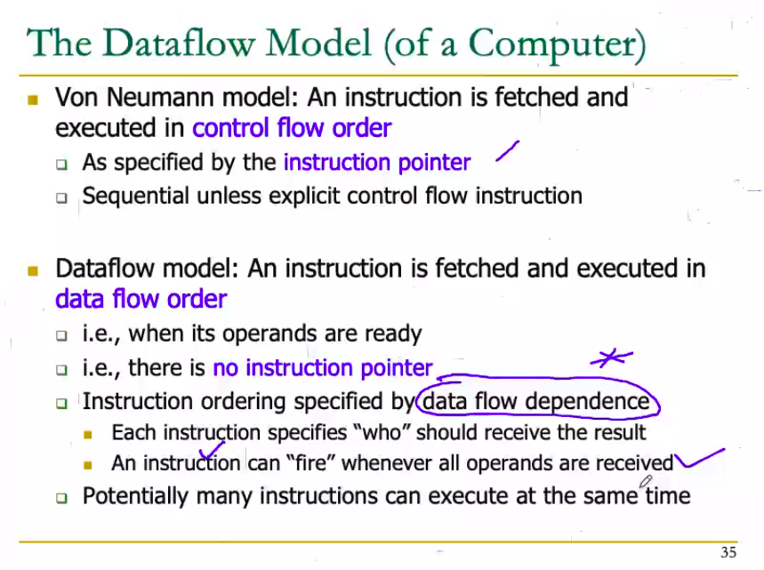
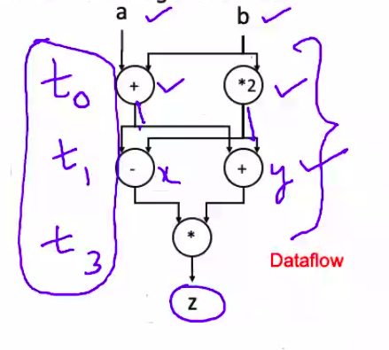
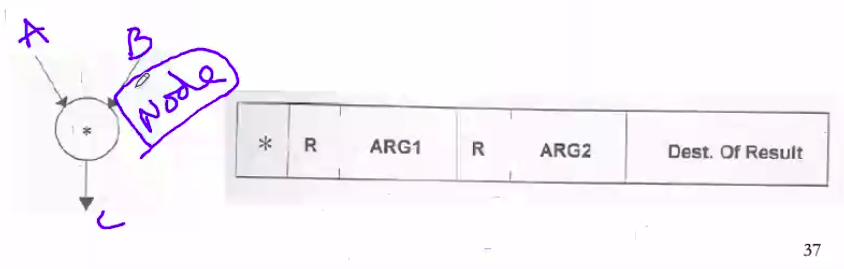
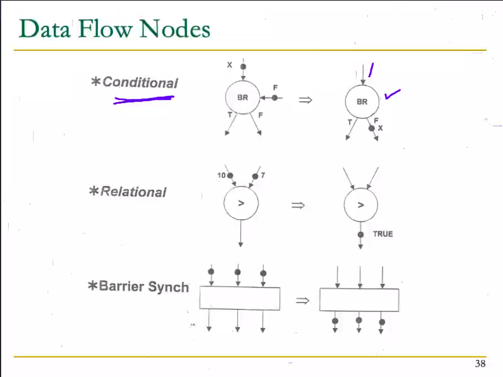
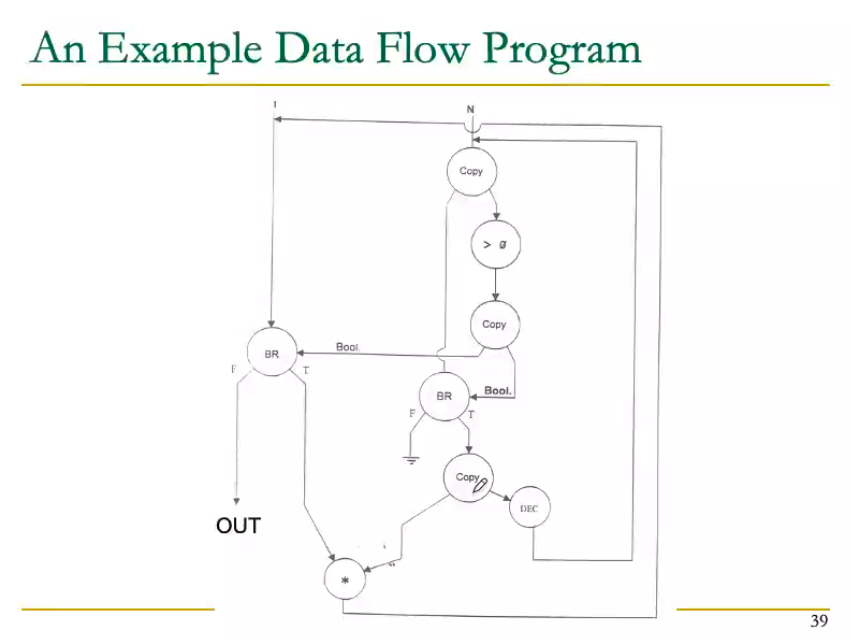

# August 31, 2020

## What is a computer?
Three key components:
- Computation
- Communication
- Storage (memory)



Memory System -> Not persistent
Storage System -> Persistent

We will learn how the components are designed.

- Goal of communication unit is to make sure that a submitted application is executed and desired results are produced.
- Computing unit -> Execute the commands received by communication unit.



Memory -> Stores the program and the data both
1. Program is first loaded into the memory from the storage.
2. It is stored somewhere in the memory.
3. One instruction after the other is fetched for the processor. 
4. The processor then understands that specific instruction. In order to understand the instruction, it must decode it. **The instructions are stored in encoded form**.
5. While executing the program, we might need input from the user, or load other files from the storage (or maybe even variables). CU will then make calls for that from the memory.
	- Like in C programs we use fopen();
6. After decoding the instruction, the processing performs the **task on the given architecture.** (Which is also mentioned in the particular instruction).
7. After the control unit understands that the instruction is over, it then calls another instruction from the memory to the control unit.

- Suppose the program **P2** has defined some variables, say **x** and **y**, the variables will be stored inside our memory. The amount of memory occupied by the variables is dependent on the data type of the variable.

## Side note
Memory is a linear array of storage
|        |
|--------|
|        |
|        |
---
## The Von Neumann Model / Architecture

- AKA *stored program computer* (instructions **stored** in memory). Two key properties:
	- Stored program
		- The instructions are stored in a linear memory array.
		- **Memory is unified** between instructions as well as data.
			- The interpretation of a stored value depends on the control signals: `When is a value interpreted as an instruction and when as data?`
			- Since we are storing instructions and data in the same place, the CU could get confused. We need a method to differentiate them
	- Sequential instruction processing
		- One instruction processed at a time (fetched, decoded, executed). ==> We say that the one particular instruction is completed
		- One solution: **Program counter** (instruction pointer). identifies the current instruction.
		- **Program counter is advanced sequentially** and automatically progresses to the next instruction when the current instruction is executed.
```
What if we use an if statement?

if() {
	//Noice
} else {
	//Schmort
}

This deviates from routine sequential 
execution, the instruction set must then
include a line of instruction to identify 
if/else fork. 
```
> In Von Neumann model, the Memory Address Registers and Instruction Address Registers are stored in the same memory block.
## The Von Neumann Model (of a Computer)


> The VN Model is NOT the only computer architecture, just one of them.


## The Dataflow Model (of a Computer)

- The current architecture model is more complicated.
- In early days, comp. architects' main focus was only to execute instructions (sequential execution).
- Sequential execution can sometimes delay the output, which can be done in a faster way.



- Von Neumann model: An instruction is fetched and executed in control flow order.
	-  As specified by the instruction pointer
	- Sequential unless explicit control flow instruction.
- Dataflow model: An instruction is fetched and executed in **data flow order**.
	- i.e. when its operands are ready
	- i.e. when there is **no instruction pointer**.
	- ...continue 


## Von Neumann vs Dataflow

Consider a Von Neumann program:
| VN MODEL (sequential) |
| - |
| v <= a+b |
| w <= b*2 |
| x <= v-w |
| y <= v+w |
| z <= x*y |

- What is the significance of program order?
- What is the significance of storage locations?
	
Above program can be improved using Dataflow as such:



T0 Cycle ->
T1 Cycle -> X and Y
T2 -> get Z

Dataflow cycle only needs three cycles, however Von Neumann model needs 5 cycles, because VN is sequential.

> How do instructions work in Dataflow model?

## More on Dataflow
- In a data flow machine, a program consists of data flow nodes
	- A data flow node fired (fetches and executes) when all its inputs are ready
		- i.e. when all inputs have tokens.
- Data flow node and its ISA representation:




Barrier Synch: 
	When there are multiple inputs, the output is not produced until all input are available, and the decision is made inside the barrier.

## Example of Dataflow Model of a Program

Below is the representation of a dataflow model of a program to calculate n! :

