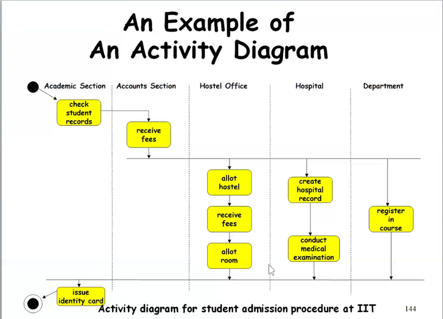
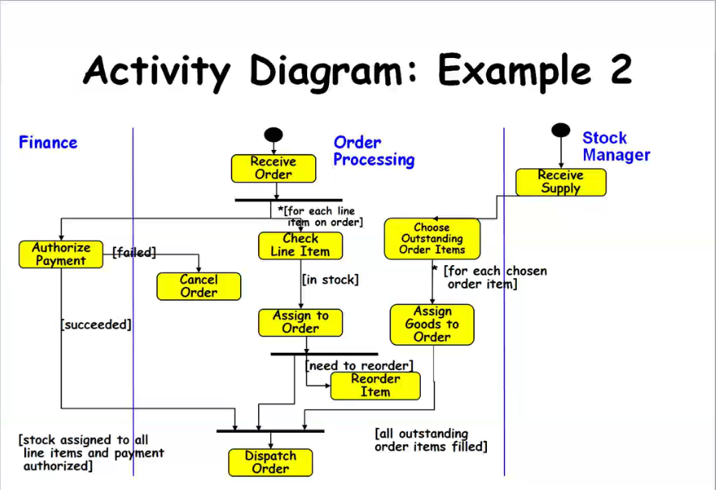
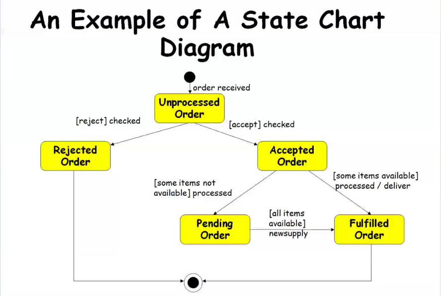
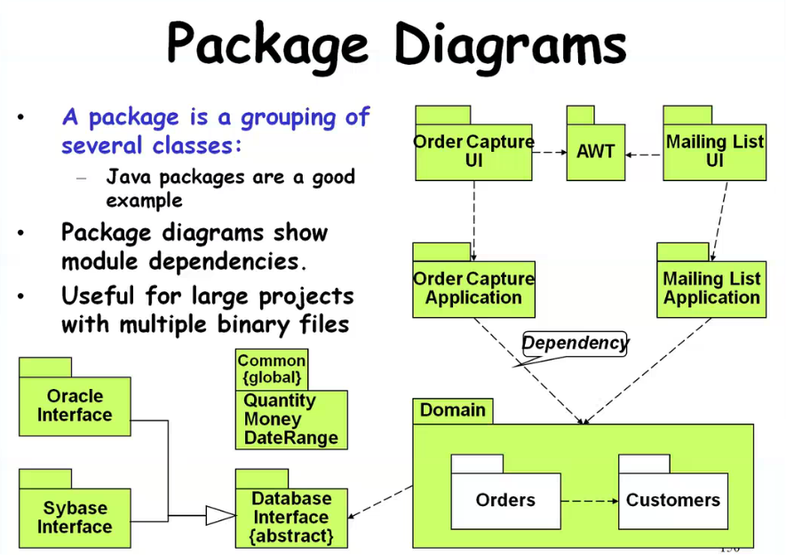
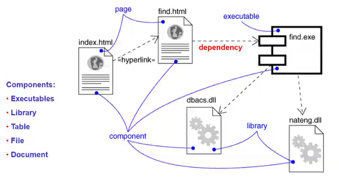
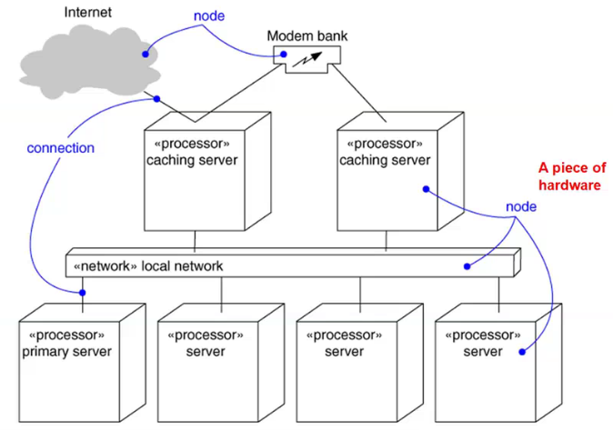

### Activity Diagram

- Not present in earlier modelling techniques:
	- Possibly based on event diagram of Odell[1992]
- Represents processing activity, may or may not correspond to methods
- Activity is a state with an internal action and one / many outgoing transitions
- Somewhat related to flowcharts

---

### Activity Diagram vs Flow Chart

- Can represent parallel activity and syncronization aspects
- **Swim lanes** can be used to group activities based on who is performing them.
- Example: Academic department vs. hostel

---

### Activity Diagram

- Normally employed in business process modelling.
- Carried out during requirements analysis and specification stage.
- Can be used to develop interaction diagrams

---

---

---

### State Chart Diagram

- Based on the work of **David Harel**[1990]
- Model how the state of an object changes in its lifetime (across several use case executions)
	- If modelling some behavior involving several objects collaborating each other, then state chart is not good option. Then, use sequence or collaboration diagram.
- Based on Finite State Machine (FSM) formalism.

---

### State Chart Diagram

- State chart avoids the problem of state explosion of FSM (too many states and too comples model).
	- FSM consists of finite number of states for an object being modelled.
	- Object undergoes state change when specific event occur
	- FSM existed earlier even used in many applications including in theorotical computer science.
- Hierarchial model of a system:
	- Represents composite **nested** states

---

### State Chart Diagram

- Elements of state chart diagram
- **Initial State:** A filled circle
- **Final State:** A filled circle inside a larger circle
- **State:** Rectangle with rounded corners
- **Transitions:** Arrow between states, also boolean logic condition (**guard**)
- Pseudo transition: Automatic and implicit transition (eg. From rejected order state to end state)

---

---

### Package Diagrams

- **A package is a grouping of internal classes:**
	- Java packages are a good example
- Package diagrams show module dependencies
- Useful for large projects with multiple binary files

---

### Component Diagram

- Captures the physical structure of the implementation (code components)

---

### Component Diagram

- Captures the physical structure of the implementation
- Built as a part of architectural specification
- Purpose
	- Organise source code
	- Construct an executable release
	- Specify a physical database
- Developed by architects and programmers

---

### Deployment Diagram

- Captures the topology of a system's hardware

---

### A Design Process

- Developed from various methodologies.
	- However, UML has been designed to be usuable with any design methodology
- From requirements specification, initial model is developed (OOA)
	- Analysis model is iteratively refined into a design model.
- Design model is implemented using OO concepts

---

*To be continued*

