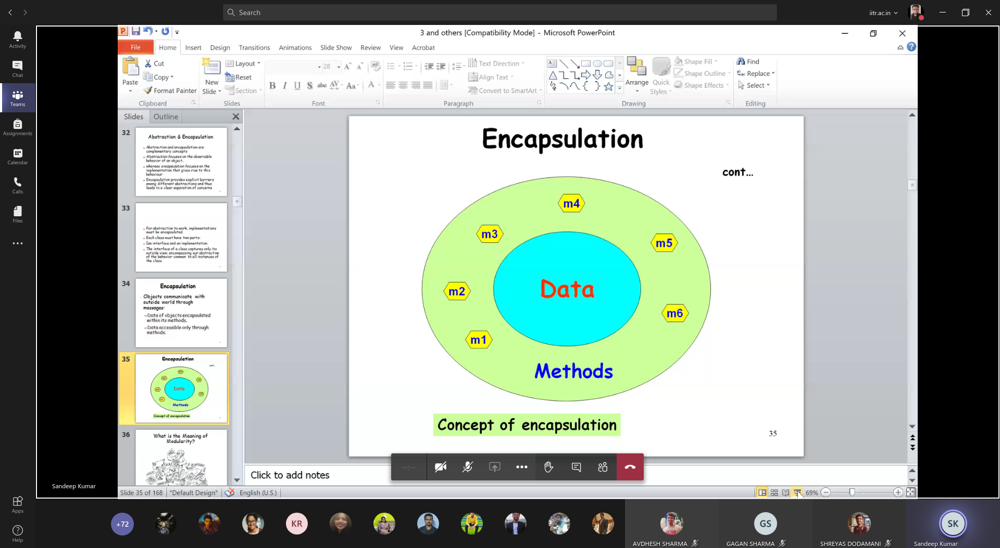

### What is the meaning of encapsulation?

- Encapsulation is achieved through information hiding (not just data handling), which is the process of hiding all the secrets of an object that do not contribute to its essential characteristics.

---

### Abstraction and Encapsulation

- Abstraction and encapsulation are complementary concepts
- Abstraction focuses on the observable behavior of an object
- whereas encapsulation focuses on the implementation that gives rise to this behavior
- Encapsulation provides explicit barriers among different abstractions and thus, leads to a clear separation of concerns

---

- For abstraction to work, implementations must be encapsulated
- Each class must have 2 parts:
	- An interface
	- An implementation
- The interface of a class captures only its outside view, encompassing our abstraction of the behavior common to all instances of the class

---

### Encapsulation

- Objects communicate with the outside world through messages:
	- Data of objects encapsulated within its methods
	- Data accessible only through methods

---

---

### What is the Meaning of Modularity?

- Modularity packages abstractions into discrete units

> Software reusablity is directly proportional to modularity
> Good Design => Highly independent modules
>
> "Umesh, please mute your mic"
>
> Reuse many modules from past software. The effort of making new modules is saved.
> Use of human and financial resources is optimized.
>
> Lead to the concept of **plugins**
> Component Based Software Development

---

- Act of partitioning a program into individual components can reduce its complexity
- Creates well-defined, documented boundaries (or interfaces) within the program
- Modules are essential to help manage complexity
- **Modularity is property of a system that has been decomposed into a set of cohesive and loosely coupled modules**

- *Read what the hell coupling and cohesiveness is*

> Large software => Without modularity it would be hell of a task to divide work among developers
> Easy to create well documented modules for a software

---

### What is the Meaning of Hierarchy?

- Heirarchy is a ranking or ordering of abstractions
	- Multiple Inheritance
	- Aggregation

> Ordering of different classes
> Relationships generated between classes

---

### What is the Meaning of Typing?

- Strong typing prevents mixing of abstractions

---

- Typing is the enforcement of the class of an object, such that objects of different types may not be interchanged, or at the most, they can be interchanged only in very restricted ways.
- Typing lets us express our abstractions
- Strong typing prevents mixing of abstractions.

---

- For example, an object may have both a class and a type. In smalltalk, objects of the classes SmallInteger, LargeNegativeInteger, and LargePositiveInteger are all of the same type Integer

---

### Static and dynamic typing

- Static typing (also known as static binding) means that the types of all variables and expressions are fixed at the time of compilation.
- Dynamic typing (also known as late binding) means that the types of all variables and expressions are not known until runtime

---

### Concurrency

- Concurrency allows different objects to act at the same time.
	- Multithreading, multitasking
- Heavyweight concurrency - process independently managed by OS and independent address space
- Lightweight concurrency - lives within single OS process along with other lightweight process sharing same address space

---

### Persistence

- An object in software takes up some amount of space and exists for a particular amount of time.

---

### Benefits of the Object Model

- Many people who have no idea how a computer works find the idea of object-oriented systems quite natural
- Object model reduces the risks inherent in developing complex systems
- Object model produces systems that are built on stable intermediate forms, which are more resilient to change
- Object model encourages the reuse not only of software but of entire designs
- Object model helps us to exploit the expressive power of object-based and object-oriented programming languages

---

### What are the Different Types Of Relationships Among Classes?

- Four types of relationships:
	- Inheritance
	- Association
	- Aggregation / Comparison
	- Dependency

---

