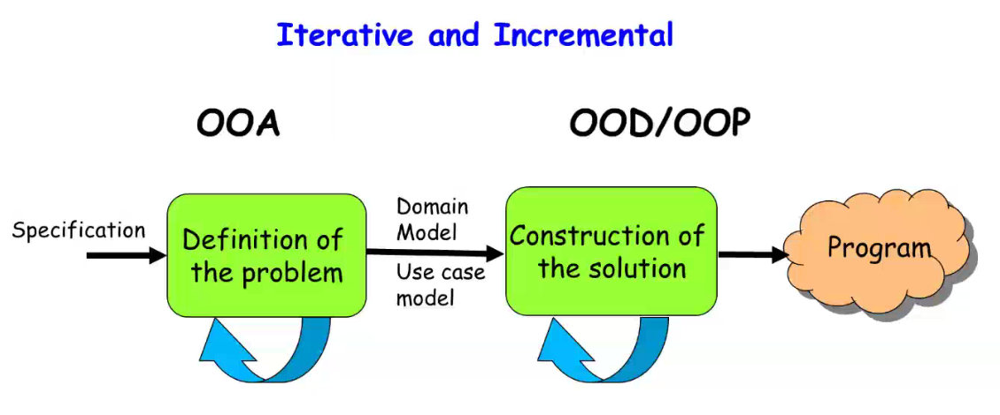
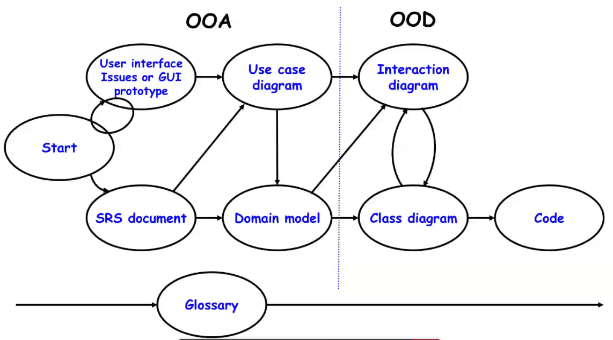
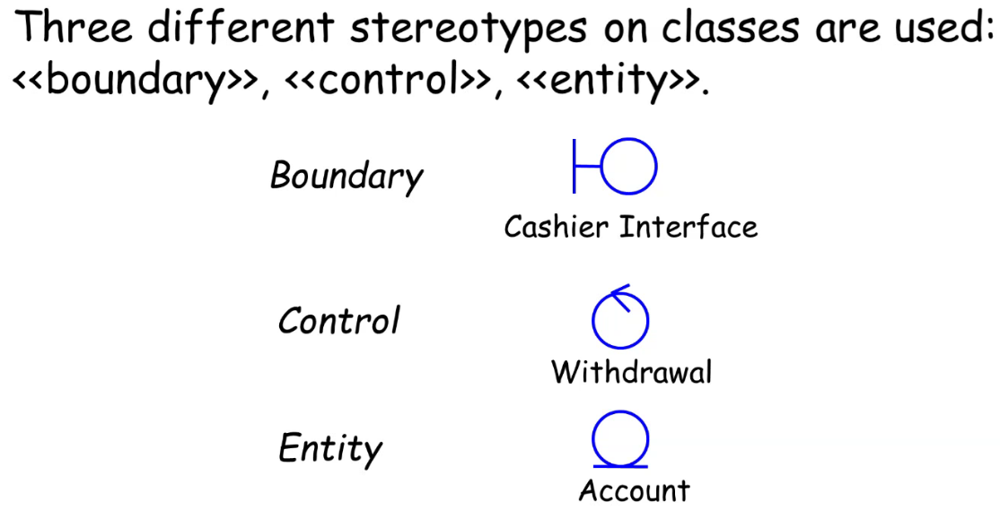
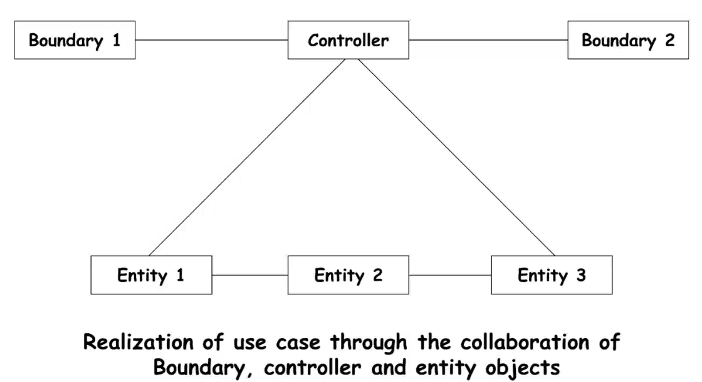

### Iterations over following 4 phases

- Inception: Define scope of project. To get clear idea of project, prototype may be developed.
- Elaboration: Functional and non-functional requirements captured.
- Construction: Analysis, design and implementation carried out.
	- Text description of use cases
	- A new iteration started for each use case
	- System features implemented in each iterations
	- Each iteration results in executable release of software
- Transition: Product installed in user's environment

---

### OOAD

---

# Unified Development Process Cont...

- Glossary is dictionary of terms which can be helpful in understanding various terms and concepts used in constructed model.

---

### Use Case Modelling

- Use cases should be appropriately packaged
- An overriding principle during use case packaging:
	- There should be strong correlation between GUI prototype. the contents of user's manual and use case model of system
	- Eg. File menu of MS-Word have new file, save file, print file, etc.
	- Each menu option in top-level menu of GUI usually corresponds to a package of use-case diagram.
- Common mistakes:
	- Clutter: Too many use cases at top level
	- Too detailed
	- Omnitting text description
	- Overlooking alternate scenarios

---

### Domain Modelling

- Represents concepts or objects appearing in the problem domain.
- Also captures relationships among objects.
- Three types of objects are identified.
	- Boundary objects
	- Entity objects
	- Controller objects

---

### Class Stereotypes

---

### Boundary objects

- Interact with actors:
	- Use interface objects
- Include screens, menus, forms, dialogs, etc.
- Do not perform processing but validates, formats, etc.

---

### Entity Objects

- Hold information:
	- Such as data tables & files, e.g.g Book, BookRegister
	- Normally corresponds to physical entities in problem description
- Blah

---

### Controller Objects

- Coordinate the activities of a set of entity objects
- Interface with the boundary objects
- Realizes use case behavior
- Embody most of the logic involved with the 

---

### Use Case Realization

---

### Interaction Modeling

- Interaction Diagrams
	- Sequence
	- Collaboration

---
