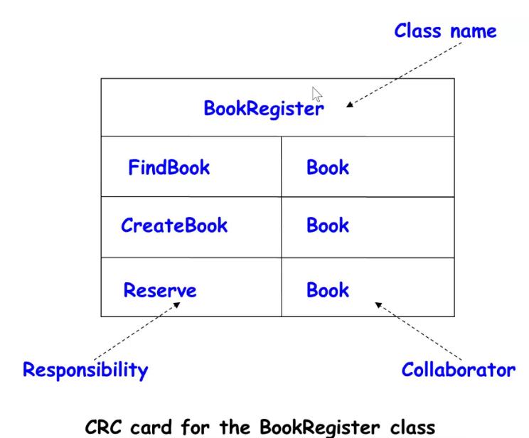
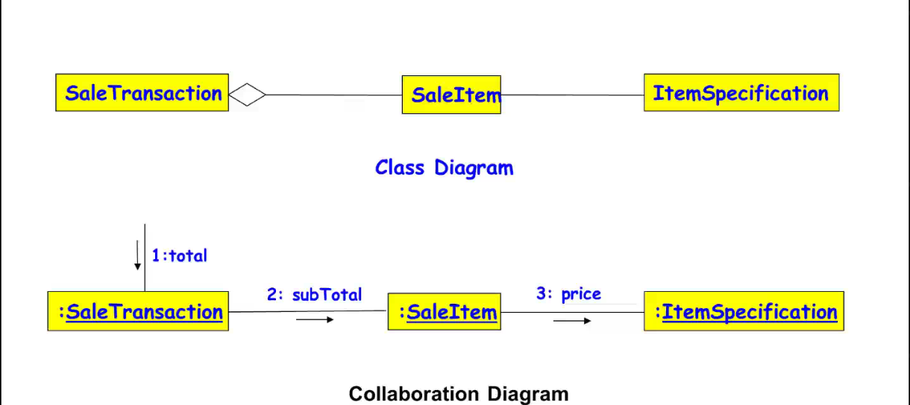

### Class-Responsibility-Collaboration (CRC) Cards

- Pioneered by Ward Cunningham and Kent Beck
- For complex user cases involving many objects, interaction diagrams will be very complex. In these cases, to handle collaboration among different objects, we may need participation of team of developers through CRC cards.
- Index cards prepared one each per class
- Class Responsibility is written on these cards.
- Collaborating object is also written.

---

- Required for developing interaction diagram 

---

### An Example of a CRC Card

- One card for each Class

---

### Patterns

- A pattern:
	- Describes a recurring problem
	- Describes the core of a solution
	- Is capable of generating many distinct designs

*Pattern: Something that is repeating*

---

### Patterns

- Experienced designers consciously or unconsciously reuse design solutions that they might have worked out in past.

- The essential idea:
	- If you can master a few important patterns, you can easily spot them in application development and use the pattern solutions.

---

### Antipattern

- If a pattern represents ...

---

### Design Patterns

- **Standard solutions to commonly recurring problems**
- Provides good solution based on common sense
- Patterns created and documented by people who spot repeating themes across designs.
- Pattern has four important parts:
	- The problem
	- The context
	- The solution 
	- ...

---

### Example Pattern: Expert

- **Problem:** Which class should be responsible for doing certain things.
- **Solution:** Assign responsibility to the Expert Class: that has the information necessary to fulfil the required responsibility.

---

### Example Pattern: Expert

---

### Example Pattern: Creator

- **Probelm**: Which class should be responsible for creating a new instance of some class?
- **Solution**: Assgin a class C1 the responsibility to create class C2 if
	- C1 is an aggregation of objects of type C2
	- C1 contains object of type C2

---

### Example Pattern: Controller

- **Problem**: Who should be responsible for handling the actor requests?
- **Solution**: Separate controller object for each use case.

---

### Example Pattern: Facade

- **Problem**: How should the services be requested from a service package?
- **Context(problem)**: A package (cohesive set of classes), example: RDBMS...
- ...

---

### Example Pattern: MVC

- Model-View-Controller
- How should the user interface (Boundary) objects interact with the other objects?
- GUI objects separated into views and controller objects
	- Controller objects: Collecting data input by user
	- Controller pass collected information to model object
	- Model object notify view and controller objects regarding change in model state.

---

