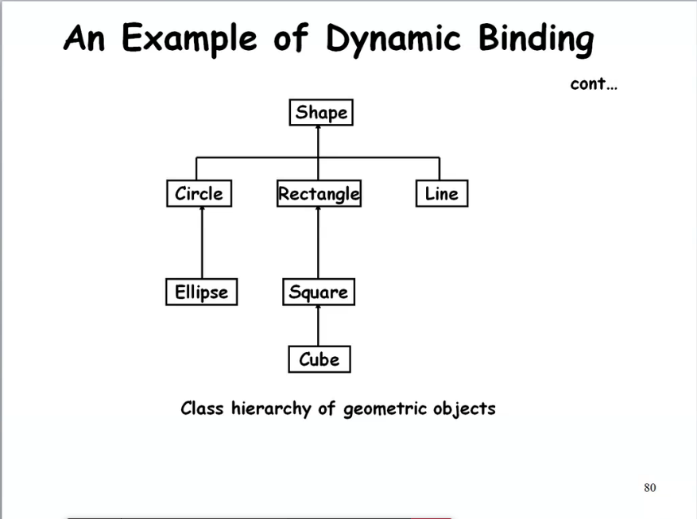
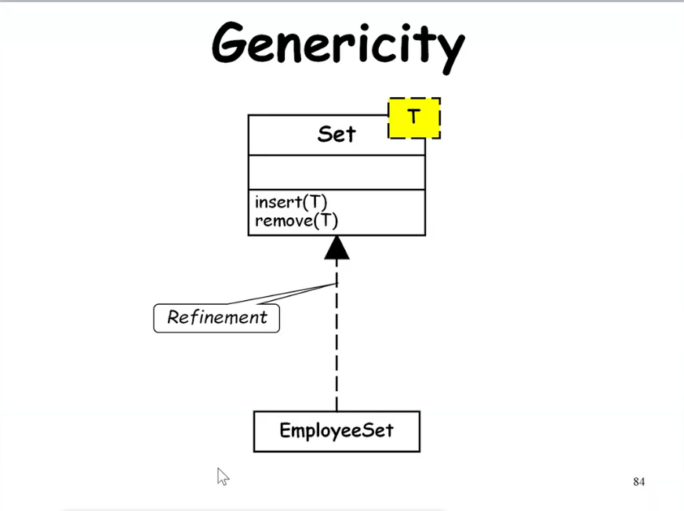

### An example of static binding

- A class named Circle has 3 definitions for create operation
	- Without any parameter
	- Center and radius as parameter
	- Center, radius and fillType as parameter
	- Depending upon parameters, method will be involved
	- Method create is said to be overloaded

---

### Dynamic Binding

- A method call to an object of an ancestor class:
	- Would result in the invocation of the method of an appropriate object of the derived class.

- The floowing principles are involved:
	- Inheritance hierarcy
	- Method overriding
	- Assignment to compatible types

---

### Dynamic binding

- **Principle of Substitutability** (Liskov's substitutability principle):
	- An object can be assigned to an object of the ancestor class but not vice versa.

---

- Exact method to be bound on a method call:
	- Not possible to determine at compile time
	- Dynamically decide at runtime

---

### An example of Dynamic Binding

- Consider a class hierarchy of different geometric objects:
	- Display method is declared in the **shape** class and overridden in each derived class.
	- A single call to the display method for each object would take care of displaying the appropriate element.

---

---

### Using Relation

- *Using* Relation: Association denotes a bidirectional semantic connection, but *using* is refinement of Association indicating client and supplier relation.
- Shown by small circle on client side

---

### Instantiation

- Genericity

---

### Genericity

- Ability to parameterize class definitions.
- Example: class **stack** of different types of elements:
	- *Integer Stack*
	- *Character Stack*
	- *Floating Point Stack*
- Define generic class stack:
	- Later instantiate as required

---

---

### Metaclass

- Class of a class -> metaclass
- Metaclass: Whose instances are themselves classes
	- Was suppoted in SmallTalk, not in C++
	- It gives idea of object and class

---

### Parameters to know quality of Class or Object Design

1. **Coupling**: Coupling of classes (like modules). Conflicting with inheritance which increases coupling
2. **Cohesion**: *Worst*: Conindidental, *Best*: Functional
3. **Sufficiency**: Class capture enough characteristics of abstraction, enough functions and items to cover required acts
4. **Completeness**: Sufficiency implies minimal, it implies all aspects
5. **Primitiveness**: Primitive operations can be efficiently implemented only if given access to the underlying representation of abstraction. E.g.: Add one element in Class Set is primitive operation, but add four element is not.

---

### What is Law of Demeter?

- The Law of Demeter (LoD) or 'principle of least knowledge' is a design guideline for developing software, particularly object-oriented programs
- "Only talk to your friends" is the motto
- Reducing the dependencies between classes to make your code more flexible (i.e. reduces coupling between objects)
- "low-coupling"
- Each component should have only limited knowledge about other units

---

### Advantages of LoD

- The advantage of following the Law of Demeter is that the resulting software tends to be more maintainable and adaptable
- Since objects are less dependeent on the internal structure of other objects, object containers can be changed without reworking their callers

---

### Advantages of Object-Oriented Development

- Code and design reuse
- Increased productivity
- Ease of testing (?) and maintenance
- Better understandability
- Elegant design:
	- Loosely coupled, highly cohesive objects
	- Essential for solving large problems

---

- Initially incurs higher costs
	- After completion of some projects reduction in cost become possible
- Using well-established OO methodology and environment
	- Projects can be managed with 20% - 50% of traditional cost of development.

---

### Object Modelling Using UML

To be continued

