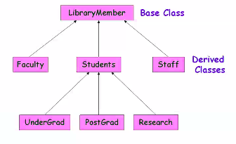
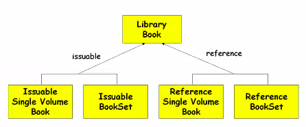
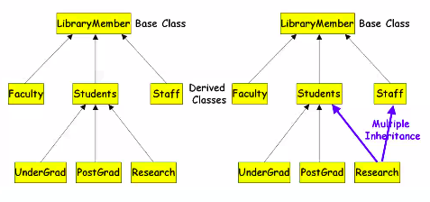
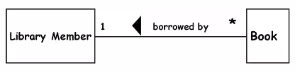
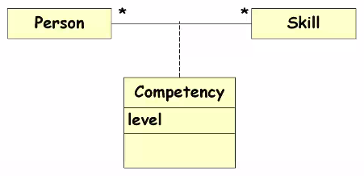
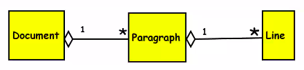
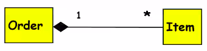
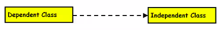

# October 5, 2020

### Combinations of Relationships
- More commonly used
	- Association
	- Inheritance
	- Aggregation
- Less commonly used
	- Using
	- Instantiation
	- Meta class

## Inheritance
Many a times on of the classes can be declared as  very generic class and the other classes are sharing a lot of properties from the generic class

In another scenario, two classes are having very common properties, where the first class is declared as the generic class and the second class is defined as the derived class.

> Sharing of structure ( data points ) and behaviour ( functions )

Inheritance is representing the ***EJ relationship???*** (Someone pl correct this) under generalisation specialisation. 
We can also say that the different classes participating in this relationship are represented by the ***EJ*** hierarchy. 

Parent / Child / Sibling classes.
Superclass / Subclasses

Subclasses can be called to be inherited by superclasses. They are the specialisation of the superclasses.

Many a time you need to redefine the structure in the subclass. You won't be using the same class all over again. You will redefine methods, override methods, etc.

***BASE CLASS DERIVED CLASS HIERARCHY***

- Single inheritance 
	- Multiple classes are derived from one base class. Frequently done in OOP
- Multiple Inheritance:
	- Subclasses inherit properties from multiple superclasses

Single Inheritance

Some yellow diagram

Multiple Inheritance

### Inheritance and Polymorphism
- How is polymorphism related to inheritance?
	- Using same name for similar functionalities.
	- For example, area method
		- one input -> takes radius of circle
		- two input -> sides of rectangle

By using this concept of polymorphism, by method overriding or sharing same constructor, within the derived classes you are redefining the methods.

If you are not using polymorphism in this scenario then code quality will be shit.
If you are not redefining a method, you will have to write it again. 
	- Difficult to manage - redundancy
	- You'll have to remember all the method names
	- You'll have to make a switch case based on number of arguments and then call the specific function
	- You could use variable number of arguments (we can pass array of arguments) but that will make code more complicated.

## Association Relationship
- Semantic connectivity b/w two classes
	- Two classes would *know* each other.
	- One class might want to use objects of another class.
	- One class might call the other class.
- This relation can be binary  or n-ary. (One to many or many to one). Can it be many-to--many? Maybe...

- A class can have association relationship with itself too.
	- Recursive association
- An arrowhead used along with name.

### 3-Ary Relationship:

In this example, there are three classes. Instead of specifying the relationship name, it is represented by a class itself.

These two terms association and link: We can say that the link is a specialisation of association relationship. Right, in this case when two classes are associated with each other automatically there is a link between the two.

The link can be dynamically created/destroyed, or, it can be static

## Aggregation Relationship
- A whole/part relationship where one object is composed of one or more other objects, each of which is considered as part of a *whole*. 
- As far as aggregation relationship is concerned, if you can recall. Whole/part relationship.
- One object acts as a `whole` object and other objects act as the `part` objects. 

> Not reflexive or symmetric, but can be transitive

- star (*) -> one or more than one
- zero or more than zero is different
- One instance of a document contains >= 1 paragraphs, and each paragraph contains >= 1 lines.

### Composition relationship
- Very similar to aggregation
	- Conceptual difference, implementation very similar

Life of the part class is same as the whole class.

- If the participating classes are changed, will the whole class still persist?
	- Yes -> Aggregation
	- No -> Composition

### Aggregation vs Composition
- Composition:
	- Think of it as allows only PUT request
	- Composite and components have the same life
- Aggregation:
	- Think of it as allows only PATCH request
	- Lifetimes are different

### Aggregation vs Inheritance
- Inheritance:
	- Different objects which are participating with each other they are normally similar in nature. 
- Aggregation:
	- More inclined to containment, Multiple object which are participating they might not be sharing the same features, they might be different

Ultimately, they are allowing the formation of a more complex structure.

- An aggregate object contains other objects.
- Aggregation limited to tree hierarchy.

## Class Dependency

