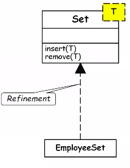

# October 6, 2020

## Polymorphism
poly -> many
morph -> forms

- Under different situations:
	- Same message to the same object can result in different actions
		- Static binding
		- Dynamic binding

By using the same calling statement (same or different parameters), same object and same function, but different results.

**Static binding:**
Area function:
	area(int r) -> Circle
	area(int a, int b) -> Rectangle

Computer knows which function to use at compile-time

Example:
```
Class Circle {
	private float x, y, radius;
	private int fillType;
	
	// POLYMORPHISM:
	public create ();
	public create (float x, foat y, float center);
	public create (float x, float y, float centre, int fillType);
}
```
<br>

**Dynamic binding:**

Exact method to be bound on a method call is not possible to be determined at compile time, but at runtime.

A method call to an object of an ancestor class would result in the invocation of method from an appropriate object of the derived class.

Following principles are involved:
- inheritance hierarchy
- method overriding
- assignment of compatible types

> For method overriding you must first implement inheritance, but you don't need method overriding for inheritance

- Principle of Substitutability (Liskov's substitutability principle):
	- An object can be assigned to another object if it is a super class

```
	// B inherits from A
	B b;
	A a;
	a = b; // possible
	b = a; // not possible
```

During the time of writing the program you need to think about how the controller will be transferred as per the grammar of the program. WTF does this mean? (Ask Ayushman he said yes sir)

## Using Relation
- 'Using' Relation: Association denotes a bidirectional semantic connection, but 'using' is refinement of Association indicating client and supplier relation.
- Shown by small circle on client side.

> One class is using the other class. 
i.e. One is dependent on the other

The class which is used by the other is called the supplier and the dependent class is called the client

Two classes are associated by some relationship. Using relation is specifically a refinement of the association relationship


## Instantiation
- Genericity
	- I hope all of you understand the term instance (instance of a class, data type.. etc). When you say that we are generating the instance of something we can say that there is class C and we generate an object C1, then we say that class C is a generic form of object C1.

However it is not in very much use but just for the sake of completeness of the concept I am considering it:

So what is happening, you are defining a class, suppose: 
- class **stack**:
	- Integer stack
	- Character stack
	- Floating point stack



## Metaclass
- Class of a class -> metaclass
- When OOD was proposed, at that time, metaclass was specified. In that case, this is pure object oriented philosophy. Pure OOD says that everything should be an object. Even classes, and functions too.

Metaclass is a class whose instances are also classes.
- Was supported in SmallTalk, but stopped at C, C++

CLASSCEPTION

## Paramaters to know quality of class or object design
What type of relationships should we have? 
These parameters are many a time conflicting with each other.

Sometimes, while improving one, you're hurting the other.
1. **Coupling**-> coupling of classes (like modules). Conflicting with inheritance which increases coupling. *Inheritance leads to greater coupling*
2. **Cohesion**-> worst: conindidental (whaat?), best: functional
3. Sufficiency: You need to have just enough number of functions (no extras).
4. Completeness: Everything that's needed must be present.
5. Primitive-ness: can be thought of as O(1) operations. Adding one element to linked list is a primitive operation (suppose), then adding four elements to list are a collection of four primitive operations


## Law of Demeter

- Maintainable and adaptable
- Code reusability

## Advantages of OOD
- Code and design reuse
- Increased productivity
- Ease of testing and maintenance
- Better understand-ability
- Elegant design
	- Loosely coupled, highly cohesive objects
	- Essential for solving large problems
- Initially incurs higher costs:
	- After completion of some projects reduction in cost becomes possible
- Using well-established OO methodology and environment:
	- Projects can be managed with 20% to 50% of traditional cost of development.
