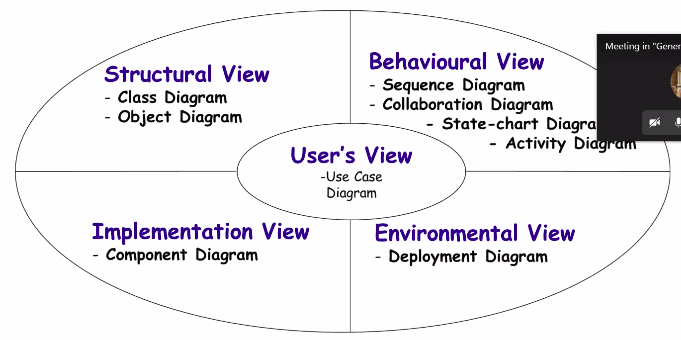
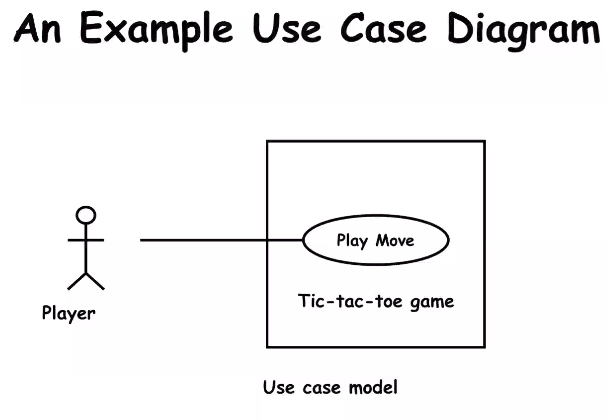

# October 13, 2020

As also we have plenty of time so that's why we can bear to devote time to all these important concepts. So.. uh, I hope you can see my slides. So in yesterday's class we discussed the different views:
- User 
- Structure
- Behavioural
- Implementation
- Environmental

## UML Diagrams
Ultimately, the base view is the user's view.

The User's view is basically the functional view of the software. All other views have to conform with the user's view. The different diagrams (9 Diagrams in the slide) serve different purposes.

## User's View
- Captures the view of system in terms of functionalities offered by system to users. Captures the view of the system from the functionality perspective.
	- Black box view
	- It is more of a functional model and all other views are object model
	- It's not talking about the internal functionalities or how stuff happens. It is hidden (meaning it is not represented in this view)
- It is in conflict with object oriented behaviour. We were talking about the different objects in the system. Now, in the central view of the design modelling, we want to define the functionalities.
- No discussion in the user view is provided regarding objects. You will even agree that the use isn't interested in the behind-the-scenes workings of the program.
- **It is the central view.** All other views must conform to the user's view.

## Structural View
- In structural view, we use the class and object diagrams. From now onward, it is object oriented behaviour.
- What is the relation between 
- If OOD is to be built, then what will be the structure of the problem? 
- Structure of the problem will be the classes and relationship between the classes.
- AKA Static view
> When I am discussing these things, please not down the important points, learn these and practice these. I will ask you to go through these, understand this properly... 

## Behavioural View
The behavioural view is a further elaboration of the structural view

- In the structural view you have represented how the objects are in relation with each other. Behavioural view is one step further. Basically, it represented the time-dependent interaction. As the execution proceeds, how will the relationships  / interactions between the objects change?

Alright so it is time dependent.

It is one of the complex views of the software. 
- State chart diagram is representing **highly time dependent** activities where the object state is changing with respect to time too.

## Implementation View
When you are designing and developing a software, there can be many components and their inter-dependence on each other. 

This diagram isn't so famous, not frequently used.

## Environmental View
How does the software interact with the hardware? This view is also required to be shown when the software is built to run on multiple types of hardware.

## Are all views required fro developing a typical system?
**NO**
- So for the most commonly used systems, 
	- use case diagram,
	- class diagram 
	- and one interaction diagram are enough to represent

State charts are useful when you want to represent the state changes in the entire software. However, when there are only one or two different states, the state chart model becomes trivial.

## Two UML Views of the System Model

There are two broad categories (from a different perspective)
- Static
	- Represent the static structure of the system
	- Objects, classes, relationships between the objects and attributes, etc
	- We have given the example of class diagrams, structures diagrams
- Dynamics
	- Behavioural view
	- How is the system collaborating or interacting with different objects?
	- e.g.: Sequence diagram, activity diagram, state charts.. etc
	- State chart diagrams aka state machine diagrams. State machine is a generic terms. State machine is famous in DLD, AI too

### Types of Diagrams
- Structure Diagrams:
	- Package
	- Component
	- Deployment
	- Composite Structure
	- Class
	- Sequence
	- Object
- Behaviour
	- Use Case 
	- Activity
	- State Machine
- Interactive
	- Communication
	- Interaction Overview
	- Timing

In Grady Booch, they have not discussed the use case diagram in detail.

## Use Case model 
- Consists of *use cases* 
- Basically it is used to represent the different scenarios under which the software is used by the users.
- Integral part of OOD.
- If you look at the underlying theme then it is more toward the functional model. 
- You have to think form the different perspectives. What are the different activities that the user can do with the system? This thought is **NOT** functional oriented design, but is very close to it.
- Even when you re grouping together modules in OOD, you group them together based on the functions of the modules. *(Interaction between the user and the system)*.
- You are representing the high-level requirements in the form of use cases.

### Use case diagrams
- In the use case diagrams, you are representing the different transactions. 
- In this case, a transaction is representing a useful action that is taken between user and system. 
- In software, it is happening with the help of message passing. 
	- The message can be a command, text message, whatever. 
	- A message is sent from user and the progrma responds to it.
- The external behaviour of the program with the user is shown in this diagram

---
- A use case is a set of related scenarios tied together by a common goal.
- Mainline sequence and all alternate sequences corresponding to the invocation of a use case is called the scenario of the use case.
	- Mainline Sequence (only one):
		- represents most common activities (system wide)
	- Alternate Sequence (can be many):
		- Ways in which the running of the program can diverge from main path
- For example: 
	- Withdrawal of cash from ATM: 
		- Mainline sequence - user inserts card, enters amount, completes transaction
		- Alternate - Password invalid, insufficient balance, 
- Communication sequence between user and system in the use case diagram:
	- Explicitly, they are independent. Implicitly, they might be dependent on each other (they might be sharing values, functions, etc)
	- For example: user is renewing a book in library:
		- As seen from outside, it is a process by itself.
		- But implicitly, it will need to use many functions under the hood for the library.

## Representation 
- A use case is represented by an ellipse
- System boundary is represented by a rectangle (overall system) annotated by the overall name of the system
- Users are represented by stick figures. It is called player in this case because it is the role that the user is playing. This role can change from scenario to scenario.
- Communication between actor and use case is represented by a line
- Another symbol: external system symbol. Stick figure annotated by label in `<< >>` So, if the Player were an external system, we would write `<<Player>>`.
	- To reduce complexity, the icon representation is same (stick figure person)
> Use case is represented by an ellipse

