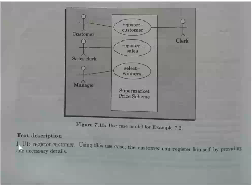

# October 26, 2020
## Text Description with Use-Case
- Description of a mainline sequence/alternative sequence in conversational style
	- Mainline sequence with simple solid line
- Contact Persons: personnel from client organisation with whom use-case discussed, date and time of meetings, etc
- Actors: Information about actors
- Preconditions: State of system before use case execution starts
- Post-condition: State of system after use case execution ends
- Non-functional requirements: constraints for designs and implementation eg. Platform conditions, response time req, etc
- Exception, error situation: only domain related errors such as lack of user's access rights, invalid entry in input fields etc.
- Sample Dialogs: it serves as example to illustrate use case

 
Text description: U1: register-customer. Using this use case, the customer can register himself by interacting with the system.

## Why Develop a Use Case Diagram?

- Serves as requirements specification
	- After gathering the requirements from the customer from the software, the requirements are put in the requirements specification document, indicating that the requirements have been discuses by the programmer and the customer

## Factoring Use Cases
- Two main reasons for factoring:
	- To represent common behaviour across different use cases - useful when there is a common behaviour 
- Many time these use cases are very complex. Specifying all the operations in a single use case diagram is very difficult. To better understand the problem, you might need to decompose it to understand in more detail or smaller operations. 

Three ways of factoring:
- Generalisation
- Includes
- Extends

###  Use Case Diagram notations: 

Use case diagrams are used to represent high level relationships between use cases, actors, and systems. It does not go into detail about the individual steps of a use case. Also, it doesn’t describe the actors (entities interacting with the system) in detail either. It gives just enough information for us to be able to understand the functions of the software.  

#### Components of a use-case diagram: 
- System:  
    The system encompasses all of the actions that are to be taken in a software. Every use case is specified within a system. The most straightforward stream of actions / steps taken by the users of the software is known as the mainstream sequence. The auxiliary sequence of actions is known as the alternate sequence. For example, if a user is interacting with the software of an ATM, then the mainstream sequence would be entering the pin and withdrawing the money. The alternate stream would be handling exceptional cases like incorrect pin or insufficient balance in the account.  
- Actors:  
    Actors are not just the users of the software, but any other entity that interacts with the system. They are objects outside the system that produce and consume data. An actor can be a person, organisation, or maybe even another system.       
- Goals:  
    The software would be designed to achieve a certain goal. A use case is a set of related scenarios tied together by a common goal.
  
#### Symbols used in use case diagrams:   
- System boundary box:  
This is the large rectangle box that encompasses all the actions of the system. Any use cases outside this box is not considered to be part of this system. The system is labelled at the top to represent its purpose.  
- Use Case Ovals:  
Use cases are represented by ovals.  
 - Actors:  
Actors, which are the entities that interact with the system are represented by stick-figure people. They are the objects that actually employ the use cases.   

#### Representing Associations  
- Association Relationship:  
They are used to associate the actors with their use cases. They are indicated using a simple solid line.  
- Include Relationship:  
They are used to indicate the use cases that are inherently related to other use cases. A dashed arrow line is drawn from the base use case (dependent use case) pointing towards the use case that it is dependent on. For example, when a person enters his pin into the ATM, the base use case is the process of entering the pin. The use case that it is dependent on is password verification. Every time that the user enters his/her pin, the password is always verified.  
- Extend Relationship:  
They are used to indicate situations where one use case arises at the execution of another use case, but not necessarily every time the base use case is executed. This is represented by a dashed arrow line from the depended-on use case to the dependent use case.  
For example, when the password is verified, it may or may not be correct. Define a use case as ‘Display error message’. This use case executes only when the password is incorrect. However, when the password is correct, we don’t need this use case. This illustrates the use of the extend relationship.  
  
- Generalisation Relationship:  
There are cases when one use case is the general or abstract form of a group of other use cases. This relationship is represented by a solid arrow line from the specific use cases to the generalised use cases.  
Let us again consider the example of the ATM. Define the use case ‘withdraw money’ as the general use case. This can be divided into ‘withdraw from checking account’ and ‘withdraw from savings account’. The solid arrow lines go from the ‘withdraw from checking account’ and ‘withdraw from checking account’ use cases to the ‘withdraw money’ use case.

