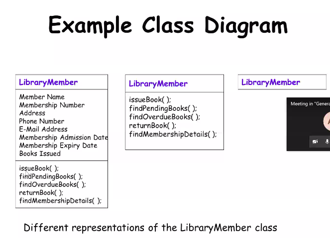
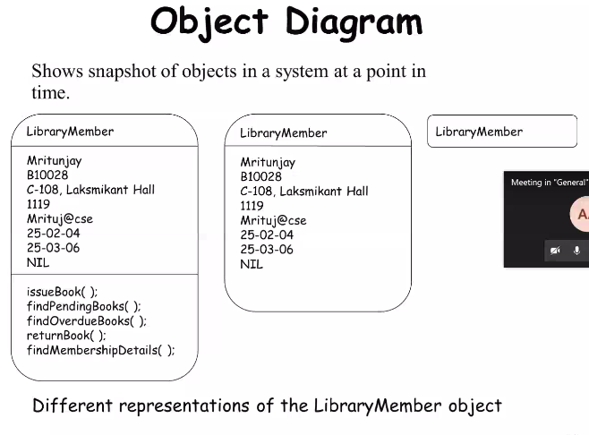
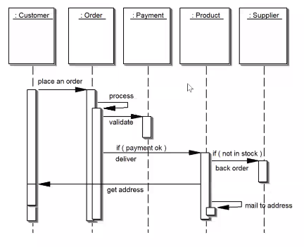
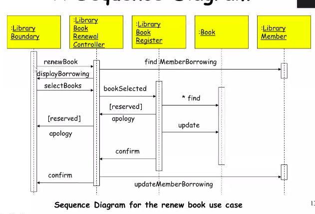
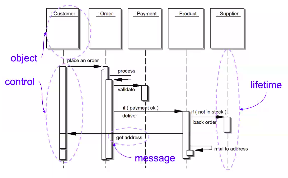
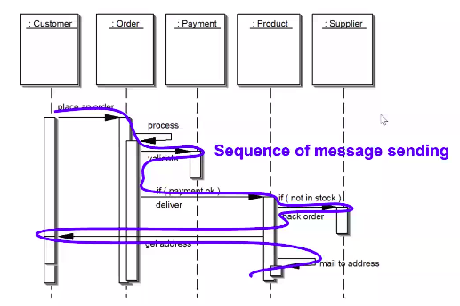
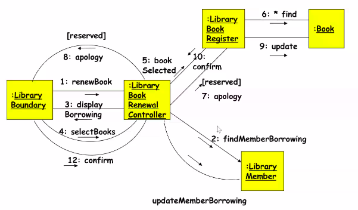

# October 27, 2020

## Class and Object Diagrams

When you are representing the relationships betwee the classes, then you are just picking up the top box of the diagram (class name) where you are representing the dependencies between the classes:

Representation of relations on classes:
- Inheritance
- Association
- Aggregation
- Composition
- General Dependency

We will represent the classes, and then we will represent the relationships between the classes.

Once we know that there are the classes that represent the static aspect of the system, we must represent the behaviour of the system (how the state of class is changing)

The state of a class at different points of times is represented by the objects. From that perspective, you also have object diagrams. You should be very much clear that the object diagrams represent the dynamic behaviour. Ultimately, the object will hold some value corresponding to the class. As the program proceeds, the values of the objects will change. Most of the time, the class diagrams are more than enough to represent the system.

> ### Function starts with lower case letters
> ### Class names start with upper name letters

## Interaction Diagram

How the different objects are interacting with each other? 
In the general scenario, up till now, it is more or less static. In interaction diagram, they are very much dependent about how you are thinking about the set of activities. Some set of actions will be required (function calls and message passing between the objects).

Once a user invokes one of the functions, required behaviour is realised through interaction of several objects.

Typically, each use case, you can draw one interaction diagram.

- Two kinds:
	- Sequence Diagram
		- Sequence is explicitly shown with a timeline
		- In which order are the different interactions between the objects are happening?
	- Collaboration Diagram
		- Timeline is not explicitly shown, but we show which objects are collaborating with each other.

- They are both equivalent, one can be derived from the other.
	- Portray the system from different perspectives

- Collaboration diagram can fulfil the purpose of sequence diagram, but mostly to show the sequence of activities, sequence diagram is used.

- These diagrams play a very important role in the design process

### Sequence Diagram

- You are ultimately representing both classes and objects and each one is having only a single instance at a time for the use case. 
- You will specify on top all the possible classes and objects that are associated with this use case.
- If required, if you feel that during execution there might be some new objects that you create, even then you might represent the object. But it is very unlikely...

- Below each object there is a dashed line which goes through the rectangle. The dotted line represents the lifetime of the object.
- If it the object has no use after a specific use case, you can put a cross after it.
- Rectangular symbol represents whether the object is active or not 

> ### Sequence diagram is read from top to bottom

- Activation of one object is connected to the activation of another object with an arrowhead which indicates which object is invoking the message. The message is represented using text.
- Two types of condition symbols:
	- **condition** - [ ] ( ) - message is sent only if the condition is `True`
	- **iteration** - * - message is sent many times to multiple objects

### Collaboration Diagram

- Shows both structural and behavioural aspects unlike sequence diagram which only shows the behavioural aspects
- Objects are collaborators which are **boxes**
- Messages between objects are shows as **solid lines**
- Message content is indicated using a **labelled arrow**.

