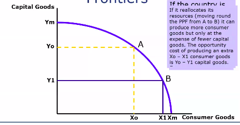

## Introduction to Economics

The basic problem we try to solve in economics is trying to satisfy our needs and wants using limited resources.

Our resources are limited while wants and needs are unlimited. How to distribute resources? For an individual person, his main resource would be his income

What are the problems a person faces when he tries to start an economic activity or business?
- **What goods and services should an economy produce?**
- **How should the goods and services be produced?** Labour-intensive, land-intensive, capital intensive? Efficiency?
- **Who should get the goods and services produced?** What community of the population is your target customer-base? Then you would design your product to satisfy their needs and attract them.

Since labour costs are low in China, multi-national countries choose to conduct labour-intensive activities in China. 

## Opportunity Cost

- Definition - the cost expressed in terms of the next best alternative sacrificed.
- Helps us view the true cost of decision making
- Implies valuing different choices.
- This is very important in making decisions

## Production Possibility Frontier

Capital Goods v/s Consumer Goods Curve

(X0 - X1) divided by (Y0 - Y1)

## How can we categorise economics?

Positive economics v/s Normative Economics

Positive economics -> Just stating the facts / telling us what's true.

Normative economics -> If the govt. does this, then GDP might increase.

## Demand and Supply
When we talk about firms and businesses that comes under micro economics. Talk about GDP, unemployment etc will come under macroeconomics. 

**Demand theory:**  Marshall describes demand as: Given a commodity and the tastes and wants of the consumer, decrease in price and increase in income would increase the demand for a commodity by the consumers.

Related commodities can be:
- Substitute goods:
	- Goods that can be bought in place of each other (like tea and coffee).
- Complimentary goods:
	- Goods that are used together. If demand for one goes up, demand for the other goes up (Like cars and fuel).

Consumer demand is a function of commodity C, it's price, price of related goods, taste of the customers, and income of the consumers.

If all other things are kept constant, there is an inverse relationship between price and demand of a good.

## Determinants of Demand
- Price of commodity
- Price of related goods
- Income of consumer --> More income == Greater purchasing power!
- Tastes, preferences and habits of consumers. 
	- If there is a change in fashion, demand for the product would fall. 
- Government policies

As we know, there is an inverse relationship between price and demand, a demand v/s price curve would have a negative curve.

### Changes and Shifts in demand

> ISKA DEKHNA PADEGA

| Change | Shift|
| - | - |
|  | If we  person is consuming q quantity when price is p and q1 when price is p1, then  |

